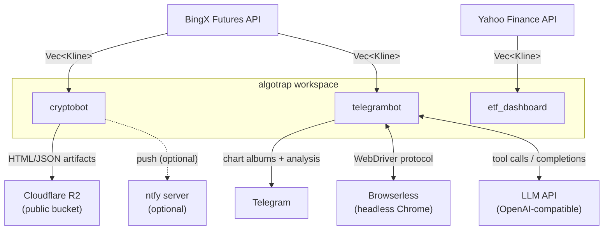
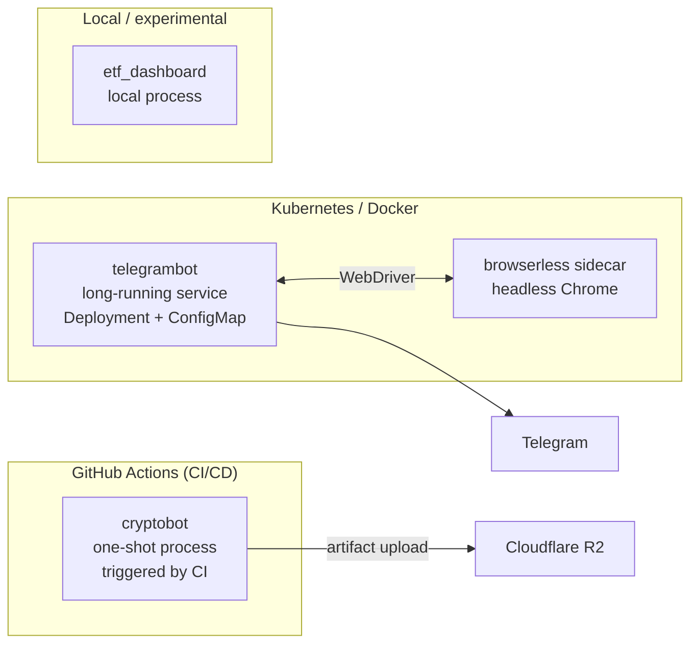
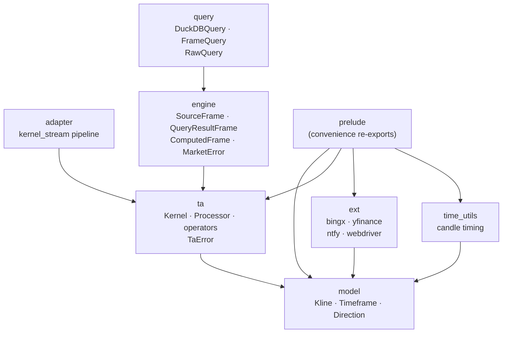
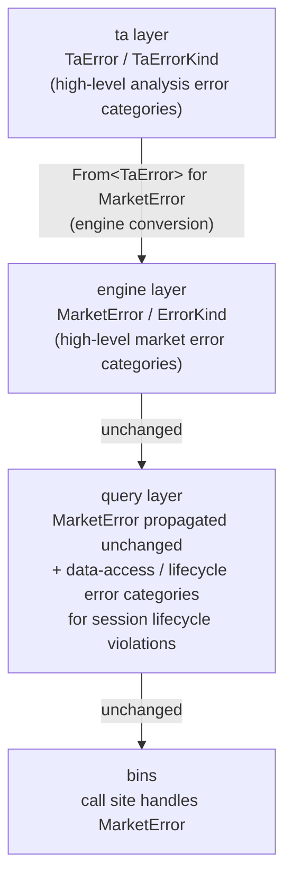

# docs/architecture.md — Workspace Architecture

> **Status**: Current (reflects live workspace as of 2026-09-09)
> **Scope**: Top-level system boundaries, workspace crates, root library structure, deployment topology
> **Audience**: Contributors new to the repo; AI agents orienting to the codebase
>
> For deep-dives follow the pointers in §11.

---

## 1. Workspace Overview

`algotrap` is a Cargo workspace comprising a root library crate together with a set of
application binary crates.

| Crate | Kind | Responsibility |
|---|---|---|
| `algotrap` (root) | library | typed synchronous TA domain (Kernel/Processor), result-frame ownership, DuckDB SQL projection, market-data adapters, domain models, candle-timing utilities |
| `bins/cryptobot` | binary | Serverless one-shot cruncher — BingX → indicators → static HTML/JSON → Cloudflare R2 |
| `bins/telegrambot` | binary | Stateful LLM-powered market analyst — K8s/Docker, LLM agent loop, posts chart albums + analysis to Telegram |
| `bins/etf_dashboard` | binary | ETF dashboard dataset builder (experimental, yfinance-backed) |

---

## 2. System Context



---

## 3. Containers / Deployables



No persistent database anywhere in the stack. All frames are ephemeral in-process values.

---

## 4. Root Library — Component Diagram



**Mandatory invariants** — enforced by module structure:

| Rule | Rationale |
|---|---|
| `model` imports nothing from this crate | leaf — no cycles |
| `ta` does not import `engine`, `query`, or `adapter` | TA domain stays pure and synchronous |
| `adapter` owns only stream adaptation | no generic compute engine |
| `engine` does not import `query` | SQL projection is optional and downstream |
| `ext` does not import `ta`, `engine`, or `query` | adapters depend only on domain types |
| Root `prelude` re-exports only `ext`, `model::*`, `ta`, and `time_utils` | convenience only; no new logic |
| Frame, query, and Kernel imports use owning paths | `engine::frame`, `query::duckdb`, `ta::prelude` |

---

## 5. Module Responsibilities

| Module | Owns | Does **not** own |
|---|---|---|
| `model` | `Kline`, `Timeframe`, `Direction` (pure DTOs, serde) | computation, I/O, validation |
| `ta` | typed analysis contract (`Kernel`/`PriorState`/`KernelStep`, `Processor<K>`), operator kernels, `TaError` | engine execution, SQL/DuckDB, app-owned graph registries, async/runtime boundary |
| `adapter` | stream-adapter pipeline and its error type | TA computation, frame types, generic compute engine |
| `engine` | result-frame types, frame traits, market error contract | SQL projection, external I/O, TA computation |
| `query` | optional DuckDB projection plus bounded raw prior-zone materialization (`src/query/gap_zones.rs`) | engine execution, persistent storage |
| `ext` | external market-data and notification adapters (feature-gated) | model types, computation, app config |
| `time_utils` | candle-timing helpers | model construction, computation |
| `prelude` | convenience re-exports of `model::*`, `ta`, `ext`, `time_utils` | any new logic |

---

## 6. End-to-End Data Flow

```
1. ACQUIRE    external adapters fetch market data
                   → Vec<Kline>  (oldest-first, validated by ext adapters)

2. AGGREGATE  application-owned aggregate Kernel + state
                    Processor consumes Kline rows, yields stamped typed rows
                    → stamped typed rows

3. PROJECT    application projector assembles SourceFrame
                   (explicitly ordered, application-owned)

4. ENRICH     (optional) splices market OHLCV columns at the front of the frame

5. PROJECT    (optional) SQL projection through the query seam
                 source-controlled SQL executed in an in-memory session
                    → QueryResultFrame  (implements ComputedFrame)

6. CONSUME    frame consumers render and deliver
               → bins own: aggregate definitions, SQL queries, rendering, delivery
```

---

## 7. Public Contracts

Key types exported by the root library. Only `model`, `ta`, `ext`, and `time_utils`
are re-exported through `prelude`; `engine` and `query` types are **not** in the
prelude and require owning-path imports.

| Contract | Type / Symbol | Module | Import path |
|---|---|---|---|
| Candle data | `Kline`, `Timeframe`, `Direction` | `model` | `model` (also directly through `use algotrap::prelude::*`) |
| Typed analysis | `Kernel`, `KernelStep`, `PriorState`, `Processor<K>` | `ta` | `ta` (also `ta::prelude`) |
| Result frames | `SourceFrame`, `QueryResultFrame`, `SourceColumnData`, `ComputedFrame` trait | `engine` | `engine::frame`, `engine::traits` |
| SQL projection | `DuckDBQuery`, `FrameQuery` trait, `RawQuery` value type | `query` | `query::duckdb`, `query` |
| Error contract | `MarketError`, `ErrorKind` | `engine` | `engine::error` |
| Candle timing | `is_closing_timeframe`, `seconds_until_next_close`, `next_close_across_tfs` | `time_utils` | `time_utils` |

---

## 8. App-Owned Boundaries

Binary crates own application behaviour beyond the root-library contract, while
repository-level deployment and CI infrastructure owns delivery automation:

| Concern | Owner |
|---|---|
| Aggregate Kernel + state definitions (per ticker × TF) | binary presentation module |
| Aggregate Kernel + state are owned in the presentation module | binary presentation modules |
| Source-controlled SQL queries (`RawQuery`) | binary source files |
| HTML chart template | binary source |
| HTML output rendering | binary presentation module |
| Scheduling, retry, loop policy, environment configuration | binary entrypoint and config |
| LLM agent loop, tool definitions | binary LLM module |
| Telegram delivery, media group albums | binary Telegram module |
| Browserless screenshot client | binary browserless client module |
| External prompt templates | binary config directory |
| Deployment manifests, container images, CI workflow | binary deployment dirs and repository CI configuration |
| Cloudflare R2 upload | CI workflow |

---

## 9. Failure Flow



`time_utils::is_closing_timeframe` returns `Result<bool, String>` (not `MarketError`).
Callers must not downcast error types; handle `MarketError` at the call site.

`TaError` carries a small set of analysis error variants. Source and alignment concerns
are owned by the adapter layer, not by `TaError`.

---

## 10. Deployment Overview

### `cryptobot` — Serverless / GitHub Actions

```
Scheduled GitHub Actions workflow
   └─ one-shot cruncher run
        ├─ BingX REST  →  Vec<Kline>  (per ticker × TF)
        ├─ aggregate Kernel + Processor  →  SourceFrame  →  SQL projection  →  QueryResultFrame
        ├─ Render: JSON artifacts  +  index.html
        └─ Cloudflare R2 object put  →  Cloudflare R2 public bucket
```

No web server, no database, no Kubernetes. Artifacts served directly from R2.
Operational detail (invocation, scheduling, upload mechanics) is documented in the per-binary README.

### `telegrambot` — Kubernetes / Docker

```
Kubernetes Deployment  (or docker-compose)
   └─ telegrambot container  (runs on its configured interval)
        ├─ BingX REST  →  Vec<Kline>  (all configured TFs)
        ├─ aggregate Kernel + Processor  →  SourceFrame  →  SQL projection  →  QueryResultFrame
        ├─ Browserless sidecar  →  PNG chart screenshots  (all TFs)
        ├─ LLM agent loop (multi-turn tool calls)  →  analysis text
        └─ Telegram: media group album  +  text  →  chat / group
```

Configuration is environment-driven; prompt templates are mounted as a ConfigMap.
Frames are ephemeral — no persistence between runs. Operational detail is in the per-binary README.

---

## 11. Navigation

Where the detail lives — follow these links rather than re-listing it here:

| Topic | Document |
|---|---|
| Workspace introduction, feature gates, extension checklist | [`src/README.md`](../src/README.md) |
| Domain models — `Kline`, `Timeframe`, `Direction` | [`src/model/README.md`](../src/model/README.md) |
| Typed analysis contract, operators, `TaError`, invariants | [`src/ta/README.md`](../src/ta/README.md) |
| Result-frame types, market error contract, projector boundary | [`src/engine/README.md`](../src/engine/README.md) |
| SQL projection seam, session lifecycle, query contract | [`src/query/README.md`](../src/query/README.md) |
| Stream-adapter boundary | [`src/adapter/README.md`](../src/adapter/README.md) |
| External adapters | [`src/ext/README.md`](../src/ext/README.md) |
| Detailed stream-and-DuckDB execution flow | [`docs/architecture/stream-and-duckdb-data-flow.md`](architecture/stream-and-duckdb-data-flow.md) |
| `ComputedFrame` contract spec | [`docs/specs/computed-frame-contract.md`](specs/computed-frame-contract.md) |
| Quality gates and verification commands | [`docs/engineering/quality-gates.md`](engineering/quality-gates.md) |
| Cryptobot | [`../bins/cryptobot/README.md`](../bins/cryptobot/README.md) |
| Telegrambot | [`../bins/telegrambot/README.md`](../bins/telegrambot/README.md) |
