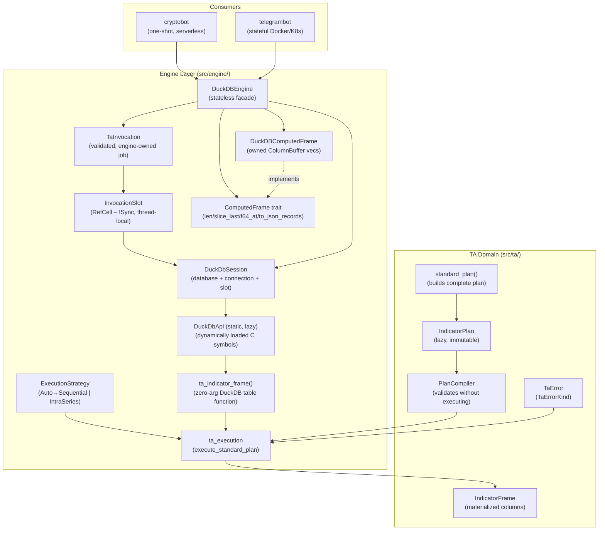
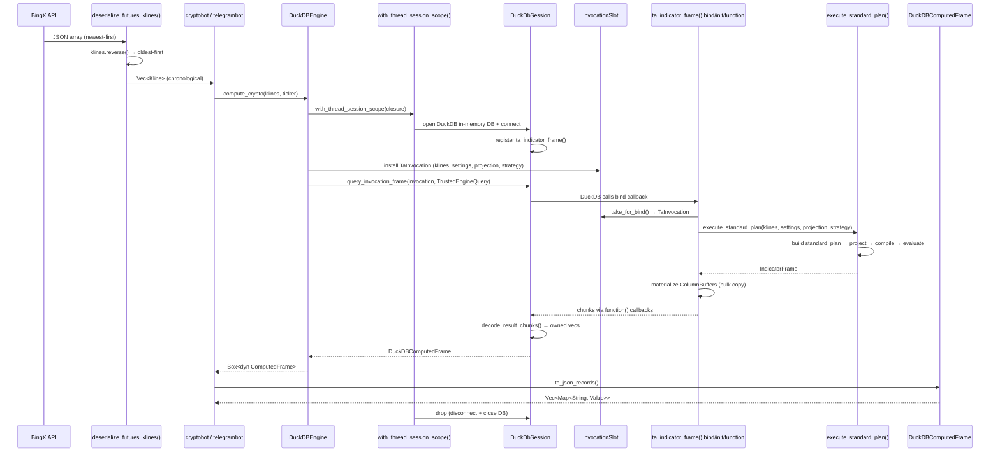
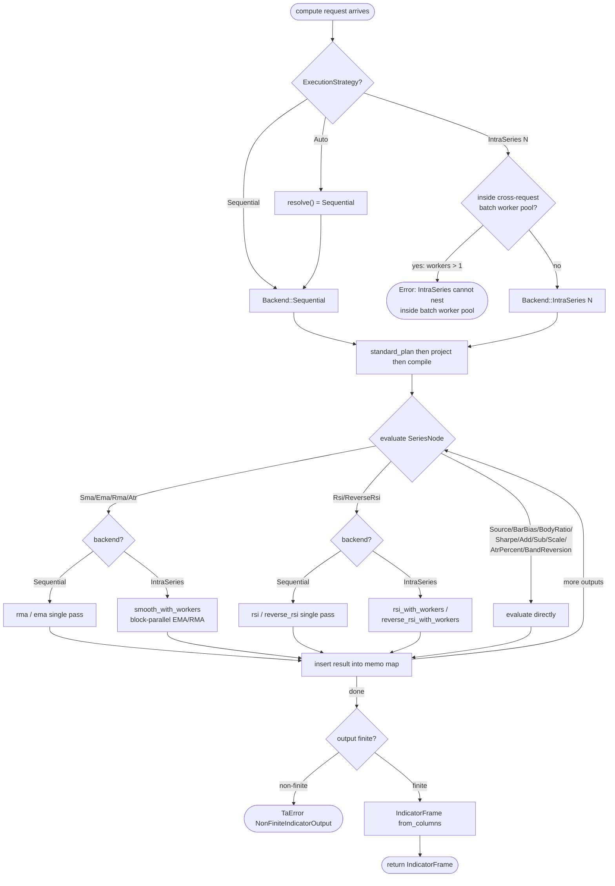
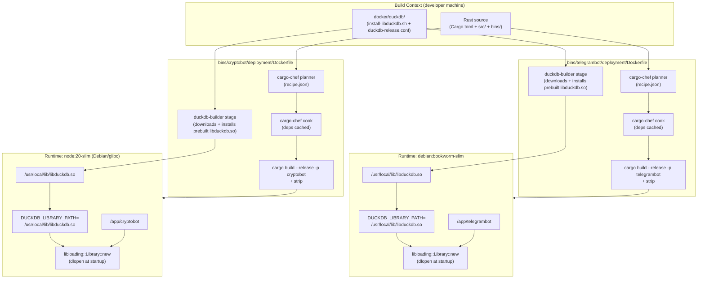

# DuckDB TA Execution Architecture

> **Status**: Current (documents live code as of 2026-08-21)
> **Scope**: `src/engine/`, `src/ta/`, BingX ingestion normalization, container build and shared-library contract
> **Audience**: Contributors working on the compute engine, TA kernels, or deployment

---

## 1. Overview

All market computation in this repository runs through a single DuckDB-backed engine pipeline. The design has three hard separations:

1. **TA domain** (`src/ta/`) — pure kernels and lazy plan expressions. Zero knowledge of DuckDB, threads, or execution scheduling.
2. **Engine layer** (`src/engine/`) — owns DuckDB session lifecycle, table-function registration/invocation, batch worker scheduling, and `ComputedFrame` materialization.
3. **Consumers** (`bins/cryptobot`, `bins/telegrambot`) — call `MarketFrameEngine` trait methods and receive `Box<dyn ComputedFrame>`.

The DuckDB C library (`libduckdb.so`) is **dynamically loaded** at process startup via `libloading`. There is no static linking, no Rust crate wrapper, and no alternate backend; a missing or incompatible library fails the process explicitly.

---

## 2. Component Ownership



### Key ownership rules

| Boundary | Rule |
|----------|------|
| TA domain | No `DuckDB`, `thread`, `worker`, or `ExecutionStrategy` references. Enforced by test `ta_sources_contain_no_engine_execution_terms`. |
| SQL production | Only `TrustedEngineQuery` (private constructor) may be passed to DuckDB. Dynamic SQL from callers is structurally excluded. |
| DuckDB allocations | Fully decoded into owned `ColumnBuffer` vecs before leaving `decode_result_chunks()`. No raw DuckDB pointer escapes the session boundary. |
| Session isolation | `DuckDbSession` is `!Sync`. Each thread owns exactly one session through a `thread_local!` slot. Sessions never cross thread boundaries. |

---

## 3. Runtime Data Flow



### BingX newest-first normalization

BingX futures-klines API returns candles newest-first. `deserialize_futures_klines()` in `src/ext/bingx.rs` calls `klines.reverse()` immediately after deserialization, before any kline reaches the engine. The invocation validator enforces strictly-increasing `time` values; out-of-order input is rejected with `ValidationError`.

### `ta_indicator_frame()` table function — static invocation model

The production table function takes **zero SQL arguments**. The engine's input job (`TaInvocation`: klines, `IndicatorSettings`, `IndicatorProjection`, `ExecutionStrategy`) is loaded into `InvocationSlot` before the query runs, then consumed by the bind callback. This makes it structurally impossible for any SQL literal or identifier from a caller to appear in the TA computation path.

The bind callback:
1. Calls `take_for_bind()` from `InvocationSlot` (one-shot; second call returns an error).
2. Calls `execute_standard_plan()` — all TA computation happens inside the bind, not in the function scan callback.
3. Declares output columns dynamically via `duckdb_bind_add_result_column`.
4. Boxes the `BindState` (materialized column arrays + `IndicatorFrame`) and hands ownership to DuckDB.

The scan callback (`function()`) bulk-copies pre-computed slices into DuckDB vector buffers — no further TA computation occurs.

### `DuckDBComputedFrame` — columnar projected frame

`DuckDBComputedFrame` owns `Vec<ColumnBuffer>` — one vector per output column. Supported column types: `Null`, `Float64`, `Int64`, `UInt64`, `Boolean`, `Utf8`. No DuckDB pointer or allocation survives the frame boundary. `slice_last(N)` returns a new frame backed by owned sub-slices (saturating, never error).

### `IndicatorProjection` — lazy output filtering

`IndicatorProjection` carries a typed set of `IndicatorOutput` values. When specified, `standard_plan().project(projection)` drops unrequested output expressions before compilation. Only the transitive closure of requested outputs is evaluated. The Telegram path selects per-indicator projections; the cryptobot path uses `IndicatorProjection::Complete`.

---

## 4. Execution Strategy Decision



### Strategy semantics

| Strategy | Effective backend | When used |
|----------|------------------|-----------|
| `Auto` | `Sequential` (current default per `resolve()`) | All production `MarketFrameEngine` trait calls |
| `Sequential` | Single-pass EMA/RMA/RSI | Explicit opt-in or test baseline |
| `IntraSeries(N)` | Block-parallel `smooth_with_workers` for EMA/RMA/ATR; parallel RMA for RSI/RevRSI | Explicit opt-in, never inside a batch pool |

**Batch nesting rule**: `validate_batch_strategy` rejects any request where `IntraSeries` is combined with a cross-request batch worker count `> 1`. The error kind is `ConfigurationError`. This is a hard policy — the intra-series workers already saturate available parallelism.

**Shared-node memoization**: `PlanExecutor` uses a pointer-keyed `HashMap<*const SeriesNode, Vec<f64>>`. Shared `Arc<SeriesNode>` references (e.g., an ATR expression reused for bands and gaps) are evaluated exactly once per execution. The test `construction_is_lazy_and_shared_nodes_are_memoized` verifies this.

---

## 5. Pure TA Errors and Kernel Contract

The TA domain uses a typed error hierarchy that the engine maps through `MarketError::from(TaError)`:

| `TaErrorKind` | Mapped `ErrorKind` | Trigger |
|---------------|--------------------|---------|
| `Validation` | `ValidationError` | Empty kline slice, non-finite kline values, non-monotonic timestamps |
| `InvalidPeriod` | `ValidationError` | Period = 0 in any TA expression |
| `InvalidPlan` | `ValidationError` | Duplicate output aliases in plan |
| `NonFiniteIndicatorOutput` | `NonFiniteIndicatorOutput` | ATR or any kernel produces NaN/inf at a row |
| `Computation` | `ComputationError` | Internal kernel arithmetic failure |
| `Alignment` | `ValidationError` | Incompatible series lengths between kernel inputs |
| `Source` | `ValidationError` | Invalid or unavailable source reference |

TA kernels (`rsi`, `rma`, `ema`, `sharpe`, etc.) are pure functions over `&[f64]` with no side effects. They do not know about DuckDB, threads, or `ExecutionStrategy`. The `IntraSeries` backend re-implements the same EMA/RMA/RSI logic using block-decomposed parallelism — results are numerically identical to `Sequential` within ≤ 1e-12 relative error.

---

## 6. DuckDB FFI / Session Lifecycle Contract

### Shared-library loading

`DuckDbApi` is a process-wide `Lazy<Result<Arc<DuckDbApi>>>` initialized once on first use. Loading sequence:

1. Read `DUCKDB_LIBRARY_PATH` environment variable.
2. `libloading::Library::new(path)` — `dlopen` on Linux/macOS.
3. Resolve every required C symbol with `get::<T>(symbol_name)`.
4. If any symbol is missing: `DataAccessError`. If the library is absent: `DataAccessError`. There is no fallback.

**Decision**: The library path is the only configuration knob. Version validation beyond symbol resolution is not performed at startup. The `duckdb_runtime_contract` integration test (marked `#[ignore]`) validates the loaded version and a typed query.

### Session lifecycle

```
with_thread_session_scope()  ← creates/increments scope depth
    with_thread_session()    ← lazily opens DuckDbSession if none exists
        DuckDbSession::open()
            api.open_database(None)   ← in-memory, no path
            api.connect(db)
            register(api, conn, Arc<InvocationSlot>)
                duckdb_table_function_set_extra_info(Arc::into_raw(slot))
                duckdb_register_table_function(conn, func)
        ...
        session.query_invocation_frame(invocation, query)
            slot.install(invocation)  ← installs, returns InvocationScope
            session.query_to_columnar_frame(query)
                api.run_query(conn, sql)
                api.decode_result_chunks(result) → DuckDBComputedFrame
    ...
scope guard drops → scope_depth -= 1
    if depth == 0: session.take() → drop DuckDbSession
        drop connection (duckdb_disconnect)
        drop database (duckdb_close)
        drop invocation_slot Arc
        DuckDB calls destroy_extra_info → Arc::from_raw(slot)
```

**Drop ordering invariant**: The connection is disconnected before the database is closed. DuckDB calls the extra-info destructor (`destroy_extra_info`) during connection teardown. The session drops its own `Arc<InvocationSlot>` after the database is closed, so the destructor never borrows freed state. Tests assert the exact phase ordering via `ThreadSessionLifecycle`.

**Nested scopes**: `with_thread_session_scope` is nestable. Inner scopes reuse the outer session (same connection, same table-function registration). The session is torn down only when the outermost scope exits.

**Thread confinement**: `InvocationSlot` is `RefCell`-backed (`!Sync`). It can only be accessed from the thread that opened the session. Batch workers each open their own session in their own scoped thread.

---

## 7. Projection / Columnar Frame / Batch Adapter Flow

### `IndicatorProjection` — lazy output filtering

`IndicatorProjection` is an ordered set of `IndicatorOutput` values. Used in two ways:

- **Complete**: all standard outputs (cryptobot path).
- **Selected**: a typed subset (Telegram path). Built from `ValidatedIndicator` enum in `telegram_indicator_projection()`.

The engine maps `ValidatedIndicator` → `IndicatorOutput` before building the `TaInvocation`. `Leverage` requests `IndicatorOutput::Atr` (required for the presentation expression), even though no `Atr` column appears in the final Telegram SQL output.

### `DuckDBComputedFrame` column layout

The frame is produced column-by-column from DuckDB result chunks:

1. `result_schemas()` — reads column names and `DuckDbType` per column.
2. For each chunk, `decode_chunk_column()` appends to the matching `ColumnBuffer`:
   - Non-null columns: direct memory copy from DuckDB vector data pointer.
   - Nullable columns: validity-bit scan + value copy.
3. `from_column_buffers()` validates equal row counts across all buffers.

Column types surfaced to callers: `Float64` (most indicators), `Int64` (`time`), `Boolean` (`is_atr_gap`), `Utf8` (presentation color strings, `Date`).

### Batch adapter flow

Both `compute_crypto_batch` and `compute_telegram_batch` use the same `execute_batch` helper:

1. `resolve_batch_worker_count(request_count, worker_count, available_parallelism)` — caps at min(available, request_count).
2. `validate_batch_strategy` — rejects `IntraSeries` if `effective_workers > 1`.
3. `thread::scope` + contiguous chunks: each worker thread gets one chunk and opens one `with_thread_session_scope`. Results are placed into a pre-allocated `ordered[index]` slot to preserve input order.
4. Failures are local to a request; a panicking worker propagates as `ComputationError("DuckDB batch worker panicked")`.

---

## 8. Container Build and Deployment Flow



### Shared-library operational contract

| Property | Value |
|----------|-------|
| Library source | Official prebuilt DuckDB release asset, checksum-verified inside the `duckdb-builder` stage (`docker/duckdb/install-libduckdb.sh`); no `.so` vendored in the repository and no source compilation |
| Build-time path | Installed in `duckdb-builder` stage; copied into the runtime image via `COPY --from=duckdb-builder /opt/duckdb/lib/libduckdb.so` |
| Runtime path | `/usr/local/lib/libduckdb.so` |
| Environment variable | `DUCKDB_LIBRARY_PATH=/usr/local/lib/libduckdb.so` |
| Target ABI | Linux amd64 or arm64, glibc (Debian bookworm); musl explicitly rejected by `install-libduckdb.sh` |
| Fallback | None — `DataAccessError` on missing or incompatible library, no alternate compute path |
| Library download | Official `libduckdb-linux-<arch>.zip` release asset downloaded by `curl` inside the `duckdb-builder` stage; SHA-256 verified (pinned in `duckdb-release.conf`) and ELF machine validated before install; runtime image performs no downloads |

**Docker platform selection**: Every stage uses `--platform=$TARGETPLATFORM`. A plain `docker build` follows the host architecture. On Apple Silicon, if `DOCKER_DEFAULT_PLATFORM=linux/amd64` is set in the shell environment it must be unset before building to produce a `linux/arm64` image. Publishing an amd64 target requires an explicit `--platform linux/amd64` flag on a native amd64 builder; the Rust builder and `duckdb-builder` stages must both target the same architecture.

**macOS local development**: Point `DUCKDB_LIBRARY_PATH` at an architecture-matched `libduckdb.dylib` (e.g., Homebrew). The `duckdb_runtime_contract` test validates the loaded library without starting a bot.

---

## 9. Error Boundaries and Compatibility

### Error kinds

| Kind | Source | Consumer impact |
|------|--------|----------------|
| `ValidationError` | Empty/non-finite/non-monotonic klines; zero periods; invalid plan | Request rejected before DuckDB opens |
| `DataAccessError` | Library load failure; DuckDB open/connect failure; query error | Process-level or request-level failure |
| `ComputationError` | Chunk decode failure; batch worker panic; column count mismatch | Individual request fails; batch siblings continue |
| `NonFiniteIndicatorOutput` | ATR kernel produces NaN/inf | Individual request fails |
| `InvocationLifecycleError` | Double-install of `TaInvocation` into the same session slot | Engine bug — should not occur in production |
| `ThreadSafetyError` | Reentrant access to thread-local session; session access outside scope | Engine bug — indicates incorrect call sequence |
| `ConfigurationError` | `IntraSeries` inside batch pool; zero worker count | Caller configuration error |

### Compatibility boundaries and known limitations

> **Decision marker**: Items below marked ⚠️ are constraints verified in code but not yet externally validated.

- **Single DuckDB version per process**: The `Lazy` singleton loads one library at startup. Different library versions in the same process are not supported.
- **Linux amd64 and arm64 / glibc for container targets**: `install-libduckdb.sh` supports `TARGETARCH=amd64` or `arm64` and explicitly rejects musl. The runtime images are `debian:bookworm-slim` and `node:20-slim` (both Debian/glibc).
- **In-memory database per session scope**: No persistent DuckDB file is used. Each `with_thread_session_scope` opens a fresh in-memory database. There is no connection pool or shared persistent state between requests.
- **No DuckDB extension loading**: The engine registers only one table function (`ta_indicator_frame`). No DuckDB extensions (httpfs, json, etc.) are loaded.
- ⚠️ **`IntraSeries` numerical equivalence**: Block-parallel EMA/RMA is algebraically equivalent to sequential but floating-point order differs. Tests assert ≤ 1e-12 tolerance. Exact bit-for-bit reproducibility across backends is not guaranteed.
- ⚠️ **`IntraSeries` vs `Sequential` performance crossover**: The intra-series backend falls back to sequential when `workers <= 1` or `values.len() < 16`. The crossover point for real throughput improvement has not been formally benchmarked against the sequential baseline.

---

## 10. Verification Commands

### Local (macOS)

```bash
# Verify DuckDB shared library loads and passes typed query
DUCKDB_LIBRARY_PATH=/opt/homebrew/lib/libduckdb.dylib \
  cargo test -p algotrap duckdb_runtime_contract -- --ignored

# Run all non-ignored engine and TA tests (no library required)
cargo test -p algotrap

# Run DuckDB-dependent integration tests (requires library)
DUCKDB_LIBRARY_PATH=/opt/homebrew/lib/libduckdb.dylib \
  cargo test -p algotrap -- --ignored

# Verify BingX newest-first normalization
cargo test -p algotrap futures_klines_normalize_bingx_newest_first

# Verify execution strategy resolution
cargo test -p algotrap auto_resolves_to_sequential

# Verify intra-series numerical equivalence
DUCKDB_LIBRARY_PATH=/opt/homebrew/lib/libduckdb.dylib \
  cargo test -p algotrap explicit_backend_preserves_standard_projection -- --ignored
```

### Container

```bash
# Build telegrambot image for the host architecture (DuckDB built from source inside the build)
# On Apple Silicon: unset DOCKER_DEFAULT_PLATFORM if it is set to linux/amd64
docker build -f bins/telegrambot/deployment/Dockerfile -t telegrambot-local .

# Build explicitly for amd64 (use on a native amd64 builder when publishing that target)
docker build --platform linux/amd64 \
  -f bins/telegrambot/deployment/Dockerfile -t telegrambot-local-amd64 .

# Verify dependencies resolve, then verify DuckDB loads through its runtime-relative path
# env -u DOCKER_DEFAULT_PLATFORM ensures the run uses the image's native linux/arm64 platform,
# not an amd64 override that may be set in the shell.
env -u DOCKER_DEFAULT_PLATFORM docker run --rm --entrypoint sh telegrambot-local -c \
  'ldd_out=$(ldd /usr/local/lib/libduckdb.so) \
   && ! echo "$ldd_out" | grep -q "not found" \
   && /usr/local/libexec/duckdb-smoke'

# Inspect DUCKDB_LIBRARY_PATH is set
docker inspect telegrambot-local --format '{{json .Config.Env}}' | tr ',' '\n' | grep DUCKDB

# Run bot with env file
docker compose -f bins/telegrambot/deployment/docker-compose.yaml up
```

---

## Appendix: Source File Index

| File | Concern |
|------|---------|
| `src/engine/duckdb_engine.rs` | `DuckDBEngine`, `DuckDBComputedFrame`, `ColumnBuffer`, `TrustedEngineQuery`, batch execution |
| `src/engine/duckdb_ffi.rs` | `DuckDbApi` (C bindings), `DuckDbSession`, `InvocationSlot`, thread-local session scope |
| `src/engine/duckdb_ta_table_function.rs` | `ta_indicator_frame()` registration, bind/init/function callbacks, `TaInvocation` |
| `src/engine/execution_strategy.rs` | `ExecutionStrategy`, `ExecutionInstructions` |
| `src/engine/ta_execution/mod.rs` | `execute_standard_plan`, `Backend`, intra-series smooth/RSI workers |
| `src/engine/traits.rs` | `MarketFrameEngine`, `ComputedFrame` traits |
| `src/engine/error.rs` | `MarketError`, `ErrorKind` |
| `src/ta/plan.rs` | `IndicatorPlan`, `IndicatorPlanBuilder`, `SeriesExpr`, `PlanCompiler`, `PlanExecutor`, `standard_plan()` |
| `src/ta/error.rs` | `TaError`, `TaErrorKind`, `TaResult` |
| `src/ext/bingx.rs` | `deserialize_futures_klines()` — newest-first reversal |
| `bins/telegrambot/deployment/Dockerfile` | Telegram container build (cargo-chef, `duckdb-builder` source compile) |
| `bins/cryptobot/deployment/Dockerfile` | Cryptobot container build (cargo-chef, `duckdb-builder` source compile) |
| `base.Dockerfile` | Multi-arch base build, musl rejection, `DUCKDB_LIBRARY_PATH` |
| `docs/specs/computed-frame-contract.md` | BDD acceptance criteria for `ComputedFrame` |
