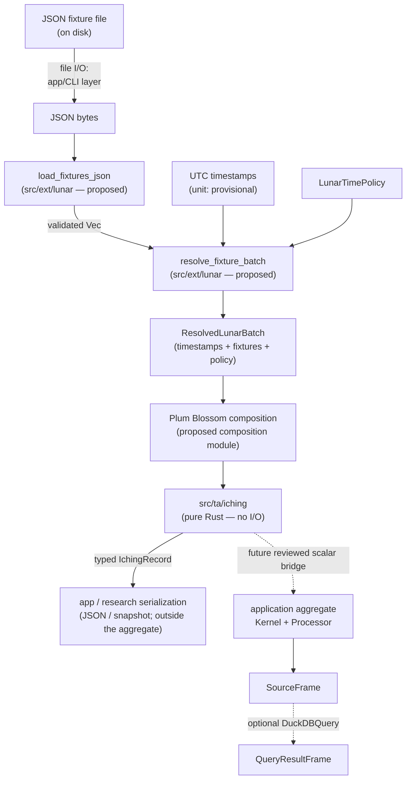

# Planned Feature: I-Ching Lunar-Calendar Integration

> **Planned / Not Implemented**
>
> This document describes a **planned** feature that does not currently exist in the
> codebase. No `src/ta/iching`, `src/ext/lunar`, `src/iching`, or `bins/iching`
> implementation currently exists. All module layouts, API names, data shapes,
> snapshot schemas, verification commands, and integration paths below are
> **proposed target state** and remain provisional until the root library contracts are stabilized and a follow-up design review is completed.
>
> **Blocked on:** root library stabilization (typed `Kernel`/`Processor`/`PriorState` contracts, `SourceFrame`/`QueryResultFrame` column semantics, `DuckDBQuery` projection seam, and `Kline.time` timestamp-unit resolution).
>
> **Current architecture references:** [docs/architecture.md](../architecture.md) · [src/README.md](../../src/README.md) · [docs/architecture/stream-and-duckdb-data-flow.md](stream-and-duckdb-data-flow.md)

---

## 1. Scope

This document describes the planned offline lunar-calendar adapter module: its
proposed public API, type contracts, module invariants, frozen time policy,
failure behavior, and integration with the planned I-Ching chart snapshot schema.

**In scope:**

- Proposed module layout and public re-exports
- `LunarFixture` v2 schema contract and JSON parsing
- Frozen v1 time policy (`LunarTimePolicy`, `LeapMonthPolicy`)
- Resolution flow: fixture → `ResolvedLunarTimestamp` / `ResolvedLunarBatch`
- `CalendarProvenance` in the planned chart snapshot schema
- Module boundary and invariants
- Failure semantics

**Out of scope:**

- `src/ta/iching` pure-core casting formulas (see
  [`docs/prds/research/iching-datetime-market-cycles.md`](../prds/research/iching-datetime-market-cycles.md))
- Filesystem fixture loading — planned to be owned by the application/CLI layer
- The Plum Blossom composition boundary — planned to be a separate composition module
- DuckDB projection integration — DuckDB does not own I-Ching computation; any
  downstream SQL projection follows the standard `DuckDBQuery` → `QueryResultFrame` seam
- Remote calendar providers, caches, or any form of network access — the adapter
  is offline and deterministic by contract
- Application deployment or service configuration

---

## 2. Proposed Module Layout

> **Note:** The exact module placement below is provisional. The final location
> depends on root library stabilization decisions about where `ext` modules live
> and whether a dedicated `iching` composition layer is warranted.

```
src/ext/lunar/              (proposed — offline lunar resolution)
├── mod.rs                  Public API re-exports
├── error.rs                LunarError, LunarResult
├── fixture.rs              LunarFixture v2 DTO, validation, load_fixtures_json
├── policy.rs               LunarTimePolicy, LeapMonthPolicy,
│                           validate_gregorian_date
└── resolution.rs           ResolvedLunarTimestamp, ResolvedLunarBatch,
                            resolve_lunar_timestamp, resolve_fixture_batch
```

All submodules are private; the full public surface is re-exported from
`mod.rs`.

**Module boundary invariant**: The lunar adapter has no `std::fs`, no `Path`
loader, no `crate::ta` imports, and no Plum/I-Ching/TA domain names. It is a
generic lunar resolution module — it knows nothing about hexagram casting,
snapshot formats, or output directories.

---

## 3. Proposed Public API

> **Provisional.** Exact type names, re-export paths, and function signatures
> remain subject to change during root stabilization and design review.

```rust
// algotrap::ext::lunar (proposed path)
pub use error::{LunarError, LunarResult};
pub use fixture::{
    LUNAR_FIXTURE_SCHEMA_VERSION, LunarFixture,
    load_fixtures_json,
};
pub use resolution::{
    ResolvedLunarBatch, ResolvedLunarTimestamp,
    resolve_fixture_batch, resolve_lunar_timestamp,
};
pub use policy::{LeapMonthPolicy, LunarTimePolicy};
```

**Note on the preferred consumer path**: downstream code should import through
the I-Ching facade module rather than reaching into the lunar adapter or the
I-Ching TA core directly. The exact facade path is provisional.

---

## 4. `LunarFixture` v2 Contract

`LunarFixture` is the only lunar representation that is ever persisted or
committed to the repository. Every field is a stable calendar semantic;
there is no source provenance, no capture metadata, no payload hash, and
no provider field.

```
LunarFixture {
    schema_version:  u32,    // Must equal LUNAR_FIXTURE_SCHEMA_VERSION (2)
    gregorian_date:  String, // Strict-padded "YYYY-MM-DD" (UTC+08:00 civil date)
    lunar_year:      i32,    // 1..=9999; year_branch derives from this
    lunar_month:     u8,     // 1..=12
    lunar_day:       u8,     // 1..=30
    is_leap_month:   bool,   // true if this month is an intercalated leap month
    fixture_id:      String, // Non-empty; part of snapshot semantic identity
}
```

`LUNAR_FIXTURE_SCHEMA_VERSION = 2`. Fixtures from schema version 1 (the
legacy source-provenance era that included `provider`, `normalizer_version`,
`contract_version`, and `payload_hash` fields) fail closed at `validate()`
because they carry a mismatched `schema_version` integer — there is no
silent migration path.

`load_fixtures_json` parses a `LunarFixture` array from JSON bytes. Fixture
files may be bare JSON arrays or objects with a top-level `"fixtures"` key.
Duplicate dates, empty documents, and documents with any invalid entry fail
closed. **Filesystem path resolution and file reading are not performed
by this module** — callers pass JSON bytes; the application/CLI layer
handles the file open.

---

## 5. Time Policy

### 5.1 `LunarTimePolicy` (frozen v1)

| Property | Value |
|----------|-------|
| Policy ID | `cst-utc8-fixed-v1` |
| Timezone | Fixed UTC+08:00 (China Standard Time; no DST) |
| Date key | Local Gregorian date `YYYY-MM-DD` |
| Zi-hour rule (v1) | CST `[23:00, 01:00)` maps to `hour_branch = 1` on the **same** local Gregorian date; no next-day key shift |
| Late-Zi `[23:00, 24:00)` | Same local date; `hour_branch = 1` |
| Early-Zi `[00:00, 01:00)` | Same local date; `hour_branch = 1` |
| `year_branch` derivation | `((lunar_year - 4) mod 12) + 1` from the fixture's `lunar_year` |

Changing the Zi-hour rule requires a new policy ID, which changes all
affected snapshot IDs by construction.

### 5.2 `LeapMonthPolicy`

| Variant | Behavior |
|---------|----------|
| `Reject` (default) | Any fixture with `is_leap_month = true` fails closed with a typed `LunarError` |
| `Allow` | Casting proceeds; the policy ID includes `leap-allow` in provenance |

The composite policy ID embedded in snapshots and snapshot IDs is
`cst-utc8-fixed-v1/leap-reject` or `cst-utc8-fixed-v1/leap-allow`.

---

## 6. Proposed Resolution Flow

The adapter resolves UTC epoch timestamps to validated lunar calendar
entries. Filesystem fixture loading (opening the JSON file) is the
application/CLI layer's responsibility. The composition from resolved lunar
timestamps to Plum Blossom casting inputs is performed by a separate
composition module, not by the adapter itself.

> **Note:** The timestamp unit (`Kline.time` seconds vs. epoch milliseconds)
> is not yet settled in the root library. The adapter must accept explicit
> timestamp arguments with a documented unit; the final integration will
> depend on the resolved root contract.



A complete `IchingRecord` is not a current aggregate input/output; only named Number/Boolean
scalar fields can cross the current aggregate contract, and the final bridge awaits root stabilization.

**Resolution invariants:**

1. The adapter never makes network requests and reads no environment variables.
2. It has no `std::fs` and performs no filesystem I/O.
3. A missing fixture for any requested local date fails closed; there is no
   Gua Qi / Fu Xi fallback and no invented lunar date.
4. `ResolvedLunarBatch::new` re-validates every entry against the batch
   policy before accepting the batch.
5. Conflicting fixtures for the same local date (different lunar semantics)
   fail batch construction with a named error.
6. Multiple candles on one civil day legitimately share the same fixture
   entry — `resolve_fixture_batch` accepts this.

---

## 7. Failure Behavior

| Condition | Result |
|-----------|--------|
| Fixture `schema_version ≠ 2` | `LunarError` at `validate()` — v1-era documents fail closed |
| Missing required field in fixture JSON | `LunarError` at deserialization — no serde defaults |
| Duplicate dates in fixture file | `LunarError("duplicate lunar fixture for date …")` |
| Empty fixture file | `LunarError("lunar fixture file contains no fixtures")` |
| Fixture date does not match requested date | `LunarError("lunar fixture mismatch: …")` |
| No fixture covers a requested local date | `LunarError("no lunar fixture covers local date …; resolution fails closed")` |
| `is_leap_month = true` under `LeapMonthPolicy::Reject` | `LunarError("leap-month casting is unsupported by the current policy …")` |
| Unrepresentable UTC instant | `LunarError("timestamp … is outside the representable range")` |
| Conflicting fixtures for one date in a batch | `LunarError("conflicting lunar fixtures for local date …")` |

All failures are typed, explicit, and fail-closed. Inputs are never
silently repaired or defaulted.

---

## 8. `CalendarProvenance` in the Planned Chart Snapshot

> **Provisional.** The snapshot schema version, field set, and `snapshot_id`
> canonical namespace are target-state proposals. The final schema depends on
> root stabilization decisions about record types and serialization contracts.

The planned `ChartSnapshot.calendar_provenance` is `Some(CalendarProvenance)`
for Plum Blossom snapshots and serialized as JSON `null` for Gua Qi / Fu Xi
snapshots. All source-side provenance fields (`provider`, `normalizer_version`,
`contract_version`, `payload_hash`, `captured_at_ms`) are excluded from the
fixture model.

```
CalendarProvenance {
    fixture_schema_version: u32,    // Shared LunarFixture schema version of all entries
    policy_id:              String, // e.g. "cst-utc8-fixed-v1/leap-reject"
    zi_hour_rule_applied:   bool,   // true if any record fell in [23:00, 01:00)
    dates: Vec<LunarDateProvenance> // One entry per unique local Gregorian date, sorted
}

LunarDateProvenance {
    gregorian_date: String,
    lunar_year:     i32,
    lunar_month:    u8,
    lunar_day:      u8,
    is_leap_month:  bool,
    fixture_id:     String,
}
```

The planned `snapshot_id` folds in all provenance semantic fields: the policy ID,
fixture schema version, Zi-hour flag, and each date's fixture semantic
identity (including `fixture_id`). A snapshot produced from different
fixtures or a different policy yields a different ID; generation
wall-clock time never affects the ID.

---

## 9. Proposed Module Boundary

The dependency direction is strictly one-way. The lunar adapter is a standalone
generic module with no dependency on the I-Ching TA core. The composition between
resolved timestamps and Plum Blossom inputs is done in a separate composition
module:

```
app/CLI binary (host — owns input loading and presentation)
    └── I-Ching facade (proposed, preferred entry point)
            ├── composition module   (lunar + ta/iching)
            │       ├── ext::lunar   (offline adapter — no I/O, no ta)
            │       └── ta::iching   (pure core — no I/O, no ext)
            └── ta::iching           (pure core re-export)
```

**Boundary invariants:**

- `src/ta/iching` (proposed) must not import `reqwest`, `tokio`, filesystem I/O,
  HTTP, or any source of network or environment access.
- The lunar adapter must not import the engine, query adapter, BingX client,
  `crate::ta`, Plum/I-Ching/TA domain names, or any host-binary error type.
  The host binary converts `LunarError` to its own error type at the call site.
- The lunar adapter must not read environment variables; all inputs are
  explicit function arguments (JSON bytes, timestamps, policy).
- Filesystem fixture loading (`std::fs::read`) belongs to the application/CLI
  layer, not to the adapter.

---

## 10. Future Work

The following capabilities are explicitly **not present** and are clearly
delineated as future work:

- **Live remote calendar providers** (e.g. a keyless community endpoint,
  a keyed commercial provider, or any HTTP source): any future adapter
  that resolves live lunar dates must live in the application layer or a
  purpose-built `ext` module; it must not be added to the offline adapter,
  which must remain offline and deterministic.
- **PVC / filesystem cache**: a versioned write-through cache for
  live-fetched normalized dates is a deployment-level concern for a
  future monitor binary, not this module.
- **Telegram delivery / monitoring loop**: a future Telegram bot that
  posts I-Ching charts should import the TA core and the lunar adapter
  directly; it does not depend on any specific binary.
- **Automatic fixture generation / normalization tooling**: the
  `LunarTimePolicy::local_noon_timestamp_secs` helper is available for
  tools that derive the correct query timestamp for a civil date; any
  live fetch and normalization is a host concern outside this module.
