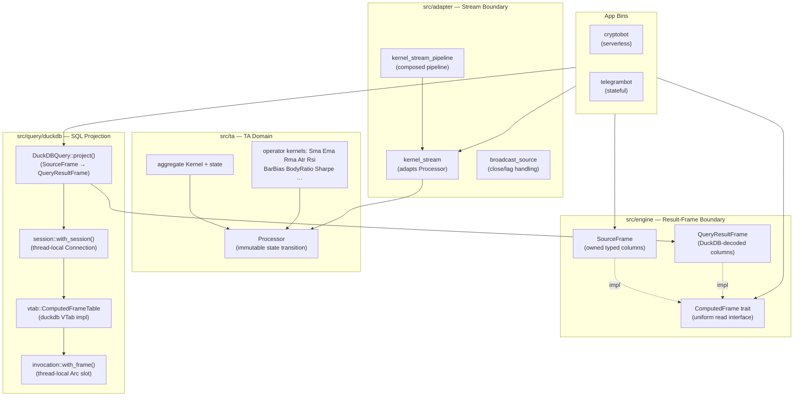
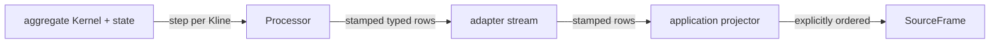
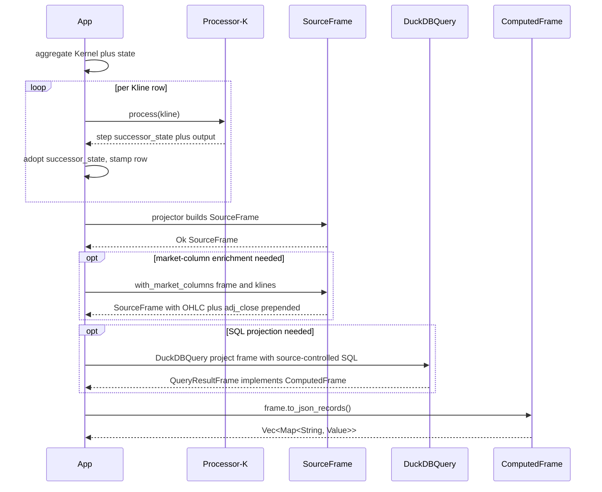

# Stream and DuckDB Data Flow

> **Status**: Current (reflects live code as of 2026-09-09)
> **Scope**: `src/ta`, `src/adapter`, `src/engine`, `src/query/duckdb` — end-to-end from
> aggregate declaration through stream materialization to optional DuckDB SQL projection
> **Audience**: Contributors working on TA computation, the adapter layer, the engine
> layer, or the DuckDB projection adapter

Related: [../architecture.md](../architecture.md) · [../../README.md](../../README.md) ·
[../../src/ta/README.md](../../src/ta/README.md) ·
[../../src/engine/README.md](../../src/engine/README.md) ·
[../../src/adapter/README.md](../../src/adapter/README.md) ·
[../../src/query/README.md](../../src/query/README.md)

---

## 1. Status and Scope

End-to-end data flow from typed aggregate declaration through stream row
materialization to optional DuckDB SQL projection. Four hard layers, strict dependency direction:

```
ta  ←──  adapter  ←──  engine  ←──  query/duckdb  ←──  app bins
```

`ta` is a leaf; `adapter` owns only stream adaptation; `engine` depends on `ta`;
`query` depends on `engine`. No layer imports from a layer to its right.

---

## 2. Component Ownership



### Ownership rules

| Boundary | Rule |
|----------|------|
| `ta` | No SQL, no engine, no threads, no async; pure value types and typed transitions. `Kernel` state and `Processor` are in-memory, session-scoped. |
| `adapter` | Owns only stream adaptation (`kernel_stream`, `kernel_stream_pipeline`, `broadcast_source`, `Stamped`, `StreamPipelineError`). Never imports from `query`. |
| `engine` | Owns `SourceFrame`, `QueryResultFrame`, `ComputedFrame`, `MarketError`. Never imports from `query`. |
| `query/duckdb` | Owns the DuckDB `VTab` registration and thread-local frame handoff. Returns `QueryResultFrame` as `Box<dyn ComputedFrame>`. Does not compute or execute the TA domain. |
| App bins | Own the aggregate Kernel + state, drive `Processor<K>`, project `SourceFrame`, optionally call `DuckDBQuery`. |

---

## 3. Aggregate and Stream Flow

Applications own one aggregate `Kernel` plus its aggregate state. The adapter adapts
`Processor<K>` into a stream; the application projector assembles `SourceFrame`.



`Processor<K>` commits state only after a successful transition; the successor state
is adopted explicitly by the caller.

---

## 4. Adapter — Stream Adaptation

`kernel_stream` adapts a typed `Processor<K>` into a Tokio stream. `kernel_stream_pipeline`
composes it; `broadcast_source` handles broadcast close/lag. The adapter owns only stream
adaptation — it never computes, compiles, or materializes.

```rust
// Happy path
let mut processor = Processor::new(my_kernel);
for kline in &klines {
    let step = processor.process(kline)?;   // TaError → adapter error via From
    // stamp typed row; adopt successor state
}
```

---

## 5. Projector → Frame Happy Path

```
1. Application owns one aggregate Kernel + aggregate state.
2. For each Kline row:
       processor.process(&kline) → step { successor_state, output }
       adopt successor_state; collect stamped typed row
3. Application projector assembles SourceFrame from stamped rows
   (explicitly ordered, application-owned).
4. Optionally: DuckDBQuery::project(output_frame, raw_query)?
        → QueryResultFrame  (also implements ComputedFrame)
5. Read via ComputedFrame:
        frame.f64_at("rsi", row)?
        frame.slice_last(20)?
        frame.to_json_records()?
```

---

## 6. SourceFrame — Market-Column Enrichment

After projection, callers may prepend raw OHLCV columns so downstream SQL can reference
candle prices alongside indicators:

```rust
let frame = SourceFrame::with_market_columns(frame, &klines)?;
// Splices 7 columns at index 0: open, high, low, close, volume, time, adj_close
// Requires frame.len() == klines.len() — ComputationError if not
```

Existing indicator column vecs are not reallocated; market columns are spliced at
index 0, indicators follow in original registration order.

---

## 7. DuckDBQuery — Optional SQL Projection

`DuckDBQuery` is stateless (`const fn new()`). It wraps `SourceFrame` in a
virtual table that the caller's SQL can query:

```rust
let owned: QueryResultFrame = DuckDBQuery::new().project(
    frame,
    RawQuery::source_controlled(
        "SELECT close, ema200, atr14 FROM computed() ORDER BY time DESC LIMIT 5",
    ),
)?;
```

`DuckDBQuery` is optional. Callers that only need `ComputedFrame` methods
(`f64_at`, `to_json_records`, `slice_last`) can skip it entirely.

### RawQuery — Source-Controlled Trust Boundary

```rust
pub struct RawQuery { sql: String }
impl RawQuery {
    pub fn source_controlled(sql: impl Into<String>) -> Self;
}
```

`source_controlled` is the **only constructor** — SQL must be authored and reviewed
as source code. No sanitization, escaping, or parameterization is applied. Do not
construct from user input or environment variables.

`computed()` accepts **zero SQL arguments**; the vtab `bind` returns
`InvocationLifecycleError` if any are present.

---

## 8. Official `duckdb` Crate — VTab/Session/Invocation Lifecycle

The project uses the official [`duckdb`](https://crates.io/crates/duckdb) Rust
crate. Session and vtab integration are built on the crate's safe Rust wrappers,
with no additional native layer.

Invocation sequence inside a single `project` call:

1. `with_session` — opens/reuses a thread-local `Connection::open_in_memory()`; increments depth.
2. `vtab::register(conn)` — registers `computed()` once per connection (idempotent).
3. `with_frame(Arc::new(frame), …)` — stores `Arc<SourceFrame>` in `INVOCATION_SLOT`; errors if slot occupied.
4. `QueryResultFrame::from_connection(conn, sql)` — prepares and executes SQL.
5. DuckDB calls `VTab::bind`: `take_frame_for_bind()` takes the `Arc`, reads column schema, calls `add_result_column`.
6. DuckDB calls `VTab::func` repeatedly: `claim_next_chunk` advances cursor; `write_column` fills `DataChunkHandle`.
7. RAII guards (`InvocationSlotReset`, `SessionExit`) clear slot and decrement depth on drop.

### Thread-local and concurrency constraints

| Concern | Mechanism |
|---------|-----------|
| Connection scope | Thread-local `SESSION` (`RefCell<SessionState>`); depth counter enables nesting |
| Connection type | In-memory, opened on first call per thread, closed at depth 0 |
| Frame handoff | Thread-local `INVOCATION_SLOT`; one `Arc<SourceFrame>` at a time per thread |
| Re-entrancy guard | `with_frame` returns `InvocationLifecycleError` if slot already occupied |
| Cleanup | RAII guards `InvocationSlotReset` + `SessionExit`; error-safe |
| Cross-thread use | `DuckDBQuery: Send + Sync`; each thread holds its own connection and slot |
| Internal parallelism | `MAX_SCAN_THREADS = 1`; DuckDB cannot spawn parallel scan workers per query |

There is **no connection pool**, **no shared mutable state** across threads, and
**no persistent database** between calls.

---

## 9. QueryResultFrame — Decoding and Lifetime

`QueryResultFrame::from_connection` materializes all rows into owned Rust vectors before
returning. No DuckDB pointer survives the frame boundary.

| DuckDB type | `QueryResultColumn` variant |
|-------------|-----------------------|
| `DOUBLE` / `FLOAT` | `Float64(Vec<Option<f64>>)` |
| `BIGINT` / `INT` | `Int64(Vec<Option<i64>>)` |
| `UBIGINT` / `UINT` | `UInt64(Vec<Option<u64>>)` |
| `BOOLEAN` | `Boolean(Vec<Option<bool>>)` |
| `TEXT` | `Utf8(Vec<Option<String>>)` |
| `NULL` | `Null(usize row_count)` |
| Any other type | `MarketError::DataAccessError` |

`QueryResultFrame` implements `ComputedFrame`; it is `Clone` but not `PartialEq`.
`slice_last(n)` is saturating. All `ComputedFrame` impls are `Send + Sync`.

---

## 10. Error Propagation

```
ta::TaError
    NonFiniteIndicatorOutput  →  MarketError { kind: NonFiniteIndicatorOutput }
    Computation               →  MarketError { kind: ComputationError }
    Validation / Period       →  MarketError { kind: ValidationError }
            │
            │  From<TaError> for MarketError  (engine/error.rs)
            ▼
engine::MarketError  ←  only type propagated to callers
            │
            │  passed through unchanged
            ▼
query::MarketError   ←  DuckDBQuery returns the same type
```

All `MarketError` constructors are named after their `ErrorKind` and support
`.with_context(…)` chaining.

| `ErrorKind` | Trigger |
|-------------|---------|
| `ValidationError` | Non-empty kline guard, non-finite inputs, non-monotonic timestamps, zero period, duplicate output names |
| `ComputationError` | Chunk decode failure, column count mismatch |
| `NonFiniteIndicatorOutput` | Kernel produces NaN/Inf at a row |
| `DataAccessError` | DuckDB connection/query failure |
| `InvocationLifecycleError` | Slot already occupied, `computed()` called outside a `with_frame` scope, SQL arguments passed to `computed()` |
| `ThreadSafetyError` | Reentrant session access |
| `ConfigurationError` | Invalid aggregate field values |
| `PartialFailure` | A batch or multi-item operation where a subset of items failed; aggregates one or more `MarketError` values from the individual item failures |

`NonFiniteIndicatorOutput` is never silently coerced to `0.0` or `NaN`; callers
decide whether to skip or abort.

`TaError` carries exactly four variants: `Validation`, `InvalidPeriod`,
`NonFiniteIndicatorOutput`, and `Computation`. Source and alignment concerns
are owned by the adapter layer (`StreamPipelineError::Source`,
`StreamPipelineError::Alignment`), not by `TaError`.

---

## 11. App Integration Sequence



---

## 12. Container DuckDB Build and Runtime

Reference: `bins/telegrambot/deployment/Dockerfile`.

| Stage | Action |
|-------|--------|
| `cook` | `DUCKDB_DOWNLOAD_LIB=1` — `duckdb` crate build script downloads prebuilt `libduckdb.so` |
| `builder` | `cargo build --release -p telegrambot`; `.so` extracted from `$CARGO_TARGET_DIR/release/deps/` |
| runtime | `debian:bookworm-slim`; `.so` at `/usr/local/lib/`; `ldconfig` registers it |
| env | `DUCKDB_LIBRARY_PATH=/usr/local/lib/libduckdb.so` — read by the `duckdb` crate's native loader, not application code |

No DuckDB extensions are loaded. Only `computed()` is registered via `vtab::register`.
Target ABI: Linux `amd64` or `arm64`, glibc. All stages use `--platform=$TARGETPLATFORM`.

---

## 13. Source File Index

| File | Concern |
|------|---------|
| `src/ta/kernel.rs` | `Kernel`, `PriorState`, `KernelStep` — the approved synchronous typed contract |
| `src/ta/processor.rs` | `Processor<K>` — state owner; commits only after a successful transition |
| `src/ta/ops/mod.rs` | Public operator kernels (`Sma`, `Ema`, `Rma`, `Atr`, `Rsi`, …) |
| `src/ta/ops/gap_candidate.rs` | Pure scalar gap-candidate detection; emits candidate facts without owning lists ([TA module contract](../../src/ta/README.md)) |
| `src/ta/error.rs` | `TaError`, `TaErrorKind`, `TaResult` |
| `src/adapter/kernel_stream.rs` | `kernel_stream` — adapts `Processor<K>` into a Tokio stream |
| `src/adapter/kernel_stream_pipeline.rs` | `kernel_stream_pipeline` — composed pipeline |
| `src/adapter/broadcast_source.rs` | `broadcast_source` — broadcast close/lag handling |
| `src/adapter/stamped.rs` | `Stamped` — stamped typed row wrapper |
| `src/engine/frame.rs` | `SourceFrame`, `QueryResultFrame`, `SourceColumnData` |
| `src/engine/traits.rs` | `ComputedFrame` trait |
| `src/engine/error.rs` | `MarketError`, `ErrorKind`; `From<TaError>` |
| `src/engine/validation.rs` | `Ticker`, `ValidatedTicker`, `parse_validated_ticker` |
| `src/query/gap_zones.rs` | Bounded raw prior-zone materialization from source frame data ([query module contract](../../src/query/README.md)) |
| `src/query/mod.rs` | `RawQuery`, `FrameQuery` trait |
| `src/query/duckdb/mod.rs` | `DuckDBQuery`, `FrameQuery` impl |
| `src/query/duckdb/session.rs` | `with_session`, `SessionState`, `SessionExit` |
| `src/query/duckdb/invocation.rs` | `with_frame`, `take_frame_for_bind`, `claim_next_chunk`, `InvocationSlot` |
| `src/query/duckdb/vtab.rs` | `ComputedFrameTable` (`VTab` impl), `register`, `write_column` |
| `bins/telegrambot/deployment/Dockerfile` | Telegram container build; `DUCKDB_DOWNLOAD_LIB=1`; `libduckdb.so` extraction |

---

## 14. Extension and Verification Checklist

### Adding a new operator / Kernel

- [ ] Add a kernel struct in `src/ta/ops/` family module; add a free-function constructor; re-export from `ops/mod.rs`.
- [ ] Add a `Kernel` impl and `Processor` wiring in `src/ta/kernel.rs` / `src/ta/processor.rs`.
- [ ] Re-export any new public surface from `src/ta/prelude.rs`.

### Adding a new `FrameQuery` adapter

- [ ] Create `src/query/<name>/mod.rs`; implement `FrameQuery`.
- [ ] Declare `pub mod <name>` in `src/query/mod.rs`.
- [ ] Enforce one-active-frame-per-thread via RAII (replicate `InvocationSlot` pattern).
- [ ] Map all backend errors to `MarketError` at the adapter boundary.
- [ ] Document the SQL trust model.
- [ ] Tests: projected column names, null passthrough, lifecycle misuse, argument rejection.

### Verifying the container runtime

```bash
# Build image
docker build -f bins/telegrambot/deployment/Dockerfile -t telegrambot-local .

# Confirm libduckdb.so resolves
docker run --rm --entrypoint sh telegrambot-local -c \
  'ldd /usr/local/lib/libduckdb.so | grep -v "not found"'

# Confirm DUCKDB_LIBRARY_PATH is set
docker inspect telegrambot-local \
  --format '{{json .Config.Env}}' | tr ',' '\n' | grep DUCKDB
```

### Local development

```bash
DUCKDB_DOWNLOAD_LIB=1 cargo test -p algotrap --locked
```

All tests run unconditionally — there are no `#[ignore]`-marked tests. The
`DUCKDB_DOWNLOAD_LIB=1` flag downloads the version-matched DuckDB shared library
at build time when no system installation is present.

For the full pre-commit sequence and focused test filters see
[`docs/engineering/quality-gates.md`](../engineering/quality-gates.md).
