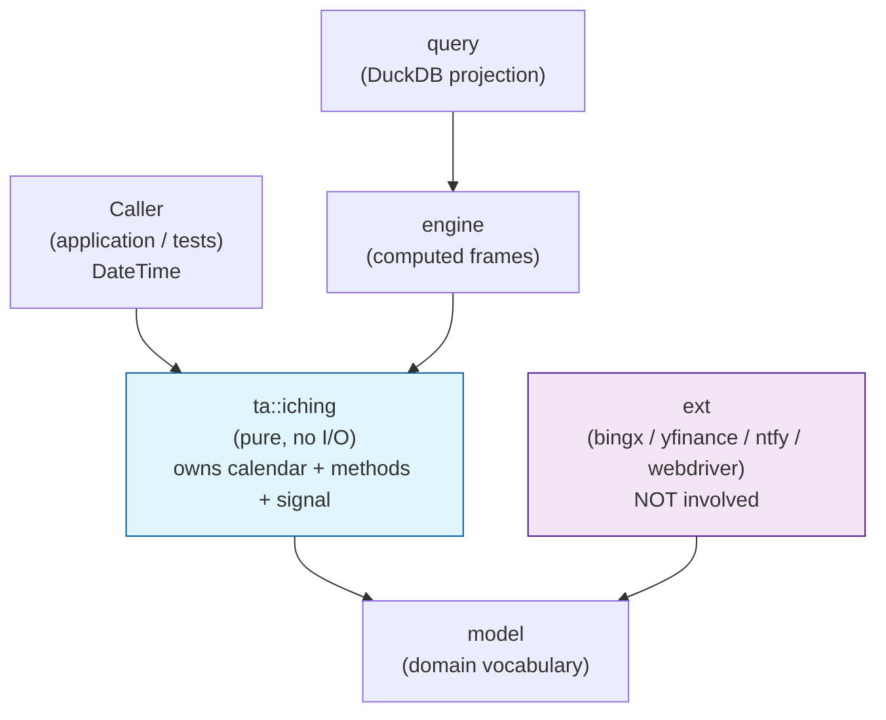
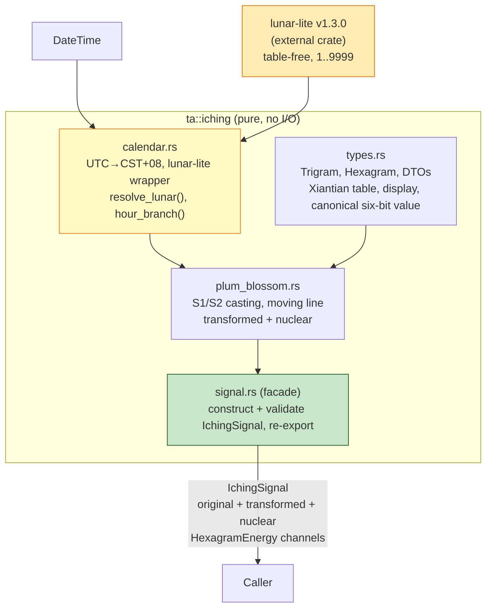
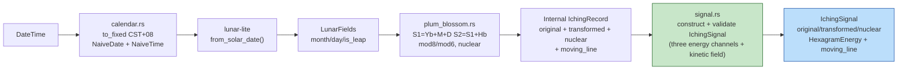

# L1 Section Decomposition — I-Ching Energy Chart Signal (IchingSignal)

**Plan level:** L1 — Section Decomposition (dispatchable for L2)
**Parent L0:** [`l0.md`](./l0.md)
**Research spec (normative):** `docs/prds/research/iching-datetime-market-cycles.md`
**Locked decisions source:** User confirmation + L0 §Locked Decisions (overrides research doc §5.1 offline fixture model)
**Authoring constraints:** No implementation code. No source-file mutation. No DuckDB, aggregate-bridge, fixture-authoring, or `Kline.time` unit resolution. Max 8 top-level sections.
**Quality bar:** Commit `7e97774` cleanliness — pure functions, typed interfaces, `TaError`/`TaResult`, no monkey patches.

---

## 1. Objective & Signal Model

### 1.1 Objective

Deliver a clean, pure-Rust **Plum Blossom** I-Ching energy-chart calculator that derives a typed `IchingSignal` struct from an arbitrary Gregorian `DateTime<Utc>` (past or future, year 1–9999 via `lunar-lite`), with **no local file caching, no fixture replay, no I/O, and no ambient state**. The calculator lives in `src/ta/iching/` and is importable only via `ta → model`. It satisfies `cst-utc8-fixed-v1` time policy and preserves the applicable Plum Blossom research invariants.

The frozen contract is a typed struct exposing separate state, transition, and internal-characteristic channels. Packing the original hexagram and moving line into one integer creates fake ordering across categorical identity and line position, and makes numerical differences unusable because they mix unrelated semantic dimensions. The chart instead receives three independently plottable hexagram-energy channels: original, transformed, and nuclear.

### 1.2 Public Signal Contract — `IchingSignal` Struct (Lossless, Separated Channels)

```rust
/// One plottable I-Ching hexagram-energy channel.
#[derive(Debug, Clone, Copy, PartialEq)]
pub struct HexagramEnergy {
    /// Canonical six-bit hexagram value B = Σ line[i]·2ⁱ. Range 0..=63.
    /// This is not a King Wen ordinal.
    pub hexagram: u8,

    /// Hexagram value centered around the six-bit range midpoint, in [-31.5, 31.5].
    /// Equal to hexagram as f64 - 31.5; this is the plottable y-value.
    pub energy: f64,
}

/// Complete method-scoped I-Ching reading at one timestamp.
#[derive(Debug, Clone, Copy, PartialEq)]
pub struct IchingSignal {
    /// Current/root state (本卦). Always present.
    pub original: HexagramEnergy,

    /// Post-trigger state (变卦 / 之卦). Present only for methods that define a moving line.
    pub transformed: Option<HexagramEnergy>,

    /// Internal/mutual characteristic (互卦), structurally derived from the original.
    /// Always present because every six-line hexagram has a nuclear derivation.
    pub nuclear: HexagramEnergy,

    /// Moving line position 1..=6 (bottom-to-top) for Plum Blossom; None otherwise.
    pub moving_line: Option<u8>,
}
```

**Why separate channels instead of a packed integer:**

- `original` is the *current/root regime state* (本卦): the canonical six-bit categorical position on the 64-symbol wheel, not a King Wen ordinal.
- `transformed` is the *post-trigger state* (变卦 / 之卦): Plum Blossom flips its moving line to derive the state toward which the reading changes.
- `nuclear` is the *inner/intermediate characteristic* (互卦): derived from the original hexagram's interior lines and used to represent the internal process of the reading.
- `moving_line` is the *kinetic trigger* — it determines the transition from original to transformed and splits Ti/Yong in Plum Blossom interpretation.
- These are **orthogonal semantic dimensions**; packing them into one integer creates fake ordering: changing the moving-line position changes the packed number even when the original hexagram state is unchanged, and differencing consecutive values mixes categorical state with positional metadata — an unusable derivative.
- Consumers plot `original.energy`, `transformed.energy`, and `nuclear.energy` as three explicitly labelled channels. `transformed` is null only when the method has no moving-line rule; `nuclear` is always a structural derivation of the original. A chart can overlay kinetic markers where `moving_line.is_some()`, scaling by `moving_line == 5 or 6`.
- The aggregate currently supports scalar Number/Boolean columns (research §5.2 blocker). A future bridge flattens this model into explicit columns such as `iching_original_energy`, `iching_transformed_energy`, `iching_nuclear_energy`, and `iching_moving_line`; it must preserve nullability for method-undefined derived channels.

**Derived quantities are materialized at the public boundary, not independently cast:**

- `transformed` is recomputed by `flip(original.hexagram, moving_line)`; it is never a second cast and never a caller-supplied mutable field.
- `nuclear` is recomputed from original lines 2–4 / 3–5; it is never a second cast and never caller-supplied mutable field.
- Materializing the derived values as `HexagramEnergy` channels avoids every chart/LLM consumer repeating the calculation, while preserving one source of truth in pure derivation functions.

**Contract guarantees:**

- Every present `HexagramEnergy.hexagram ∈ 0..=63` (validated at construction).
- `moving_line ∈ {None, Some(1..=6)}` — never `Some(0)` or `Some(7+)`; validated at construction.
- Every present `HexagramEnergy.energy` is finite and in `[-31.5, 31.5]` by construction. With midpoint `31.5` for the six-bit range `0..=63`, `energy = hexagram as f64 - 31.5`: hexagram `0` maps to `-31.5`, `63` maps to `+31.5`, and `31`/`32` straddle zero. The moving line never modifies any channel's baseline coordinate.
- Determinism: same `(DateTime<Utc>, Plum Blossom time policy)` → same `IchingSignal`. No RNG, no wall-clock read, no global cache.

### 1.3 Chart and Model-Input Semantics

- A Plum Blossom chart renders three energy series: `original.energy` (current state), `transformed.energy` (post-trigger state), and `nuclear.energy` (internal characteristic), with `moving_line` available as a separate transition marker.
- The three deterministic channels may be supplied as named historical features to an LLM or another model alongside prices and declared market features. The feature calculator neither generates a price prediction nor establishes predictive or causal validity; any later model experiment must use chronological validation, forbid look-ahead price data, and report unstable or negative results under the research specification's non-causal market-efficacy gate.

### 1.4 Delivery Scope — Plum Blossom Only

- This delivery implements **only** datetime-based Plum Blossom / Mei Hua Yi Shu casting: lunar-calendar resolution, original hexagram, moving line, transformed hexagram, nuclear hexagram, and the three midpoint-adjusted energy channels.
- `HexagramEnergy` and `IchingSignal` are deliberately method-neutral DTOs. Future Gua Qi or Fu Xi work may reuse them without changing the established Plum Blossom public contract.
- Gua Qi solar longitude, Twelve Sovereigns, Fu Xi angular quantization, and Fu Xi wheel order are deferred. They must not create code, dependencies, tests, `IchingMethod` variants, or public method dispatch in this implementation.

### 1.5 Display and Binary-Index Convention (normative, research §2.1)

- `line[0]` = bottom, `line[5]` = top; `1` = Yang, `0` = Yin.
- Display string = **top-to-bottom** `line[5]..line[0]` (e.g. Fu `[1,0,0,0,0,0]` → `"000001"`, `B=1`; Da Zhuang `[1,1,1,1,0,0]` → `"001111"`, `B=15`).
- Numeric index `B` is little-endian w.r.t. `line[]`. The library must use this single convention everywhere; no method may redefine bit order.

---

## 2. Lunar Calendar Resolution

### 2.1 Crate Selection — `lunar-lite` v1.3.0 (Locked)

| Property | Value | Rationale vs. L0 alternatives |
|----------|-------|-------------------------------|
| Crate | `lunar-lite` v1.3.0 | Table-free ShouXing astronomical algorithm (vs. table-lookup crates) |
| License | MIT | Compatible; no redistribution risk |
| Activity | Active July 2026 | Meets maintenance bar; L0 required "active" |
| Year range | 1–9999 | Covers past/future Gregorian dates without range error |
| Returns | `{ lunar_year, lunar_month, lunar_day, is_leap_month }` | Includes mandatory `is_leap_month` flag (research §3.1 leap prerequisite) |
| I/O | None — pure computation | Satisfies "no local file caching, no file I/O" |
| Caching | None | Caller must not introduce file or global memoization |

Alternatives rejected: `chinese-lunar-calendar` / `solarlunar` forks (table-based, leap semantics inconsistent), any crate requiring bundled data files, any network API.

**Cargo.toml action:** Add `lunar-lite = "1.3.0"` to `[dependencies]` (no `default-features` needed). No feature gate.

### 2.2 Expected `lunar-lite` API Surface (to be verified in Phase 1 by reading crate docs/tests)

The L1 plan assumes the following shape; Phase 1 must confirm exact symbol names and adjust the thin wrapper without changing the plan's contracts:

```rust
// Illustrative — exact names confirmed in Phase 1 discovery
// lunar_lite::LunarDate { year: i32, month: u8, day: u8, is_leap_month: bool }
// lunar_lite::from_solar_date(year, month, day) -> LunarDate
// or SolarDate::to_lunar() -> LunarDate
```

The wrapper in `src/ta/iching/calendar.rs` must isolate the crate behind a single internal function so a name change does not leak into casting code:

```rust
// Contract (no body in this plan):
// fn resolve_lunar(date: NaiveDate) -> TaResult<LunarFields>
// struct LunarFields { lunar_month: u8 /*1..=12*/, lunar_day: u8, is_leap_month: bool }
```

### 2.3 Module Placement Rationale

`src/ta/iching/calendar.rs` — NOT `src/ext/lunar/`.

- `src/README.md` acyclic rule: `ta` and `ext` both depend only on `model`; `ta` cannot import `ext`.
- `lunar-lite` is a **pure computation** crate with no I/O, no async, no network. It belongs in the `ta` layer, consistent with `chrono` already in `ta`.
- `src/ext/` remains for true external integrations (`bingx`, `yfinance`, `ntfy`, `webdriver`). Placing a pure calendar conversion in `ext` would violate the "no analysis in ext, no I/O in ta" boundary.

### 2.4 Time Policy — `cst-utc8-fixed-v1` (Locked)

- Input is `DateTime<Utc>`. First step: convert to fixed `UTC+08:00` local civil time (`NaiveDate` + `NaiveTime`).
- **Zi-hour rule:** local time `t ∈ [23:00, 01:00)` maps to `hour_branch = 1` (Zi) **on the same local date** as the lookup key. No date rollback at 23:00. This is research §6 Stage 1 "same-local-date Zi-hour rule" frozen as `cst-utc8-fixed-v1`.
- Midnight boundary is `00:00` local; branch derivation must document this explicitly.
- A UTC instant must never be treated as local solar time silently.
- The policy identifier string `cst-utc8-fixed-v1` must be baked into any snapshot/provenance `snapshot_id` derivation (future work) and documented in `calendar.rs`.

### 2.5 Leap-Month Policy

| Policy | Behavior | Error kind |
|--------|----------|------------|
| `LeapMonthPolicy::Reject` (default) | If `is_leap_month == true`, return `TaError::validation("leap month rejected under default policy")` with no signal produced (fail-closed). | `Validation` |
| `LeapMonthPolicy::Allow` | Permit casting; `lunar_month` is used as-is; provenance records `"leap-allow"` (future snapshot concern, not in this plan's output). | — |

The default `plum_blossom_signal()` entry point uses `Reject`. An explicit `plum_blossom_signal_with_policy()` overload must take the policy as a typed enum, not a bool.

### 2.6 No-Caching Invariant

- No `std::fs` read/write, no `include_bytes!` fixture, no `OnceLock` global lunar cache, no `env` read.
- `lunar-lite` itself must not be wrapped in a file cache; the wrapper is a pure function `NaiveDate → LunarFields`.

---

## 3. Architecture

### 3.1 C4 L2 — System Context (library scope)



Rules reaffirmed from `src/README.md` and L0 §4:

- `ta → model` only. `ext → model` only. No `ta ↔ ext` edge.
- `engine` and `query` are downstream and must not be imported by `ta::iching`.
- DuckDB never computes I-Ching values.

### 3.2 C4 L3 — `ta::iching` Component Decomposition



Notes:

- `calendar.rs` is the only file that depends on `lunar-lite` and `chrono`. Casting files depend on `calendar` outputs, not on the crate directly.
- `types.rs` owns the Xiantian table and bit-order invariants; all method files import from it, never duplicate the table.
- `signal.rs` is the sole public entry point; it constructs and validates the `IchingSignal` struct from separate original, transformed, nuclear, and kinetic channels and owns field validation. There is no encode/decode layer.

### 3.3 Data Flow — `DateTime<Utc>` → Plum Blossom Signal



Plum Blossom is the only method in this delivery and is the only path that consumes `LunarFields`.

### 3.4 Scoped Target File Tree

```
Cargo.toml                          [MODIFY]  add lunar-lite = "1.3.0"
src/ta/mod.rs                       [MODIFY]  pub mod iching;
src/ta/iching/mod.rs                [CREATE]  module root, public signal/channel re-exports
src/ta/iching/calendar.rs           [CREATE]  CST+08 conversion, Zi-hour, lunar-lite wrapper, leap policy
src/ta/iching/types.rs              [CREATE]  Trigram/Hexagram, Xiantian table, canonical six-bit value, display, helpers
src/ta/iching/plum_blossom.rs       [CREATE]  S1/S2 casting, transformed, nuclear (pure inputs)
src/ta/iching/signal.rs             [CREATE]  public facade: plum_blossom_signal(), IchingSignal construction, validation
src/ta/README.md                    [MODIFY]  document iching submodule boundary (optional, not dispatch-blocking)
```

Out of scope (explicitly not in tree): `src/ext/lunar/**`, `src/ta/iching/gua_qi.rs`, `src/ta/iching/solar_wheel.rs`, `src/engine/**`, `src/query/**`, `src/model/kline.rs` (untouched), `bins/**`, DuckDB adapters.

---

## 4. Core Types & Invariants

### 4.1 Xiantian Trigram Table (normative, research §2.2)

Single source of truth lives in `types.rs`. No duplication in method files.

| Number | Trigram | Chinese | Display (top→bottom) | Lines (bottom→top) | Symbol | Notes |
|--------|---------|---------|----------------------|--------------------|--------|-------|
| 1 | Qian | 乾 | `111` | `[1,1,1]` | ☰ | `mod8 == 0` maps to 8/Kun, not 0 |
| 2 | Dui | 兑 | `011` | `[1,1,0]` | ☱ | |
| 3 | Li | 离 | `101` | `[1,0,1]` | ☲ | |
| 4 | Zhen | 震 | `001` | `[1,0,0]` | ☳ | |
| 5 | Xun | 巽 | `110` | `[0,1,1]` | ☴ | |
| 6 | Kan | 坎 | `010` | `[0,1,0]` | ☵ | |
| 7 | Gen | 艮 | `100` | `[0,0,1]` | ☶ | |
| 8 | Kun | 坤 | `000` | `[0,0,0]` | ☷ | remainder-zero → 8 |

Invariants:

- `Trigram::from_num(n: u8) -> TaResult<Trigram>` rejects `n ∉ 1..=8` with `Validation`; `from_num_mod8(s: u32)` maps `s % 8 == 0 → 8`.
- `Trigram::lines() -> [u8; 3]` returns bottom-to-top. `display() -> "010"` returns top-to-bottom.
- `Trigram::from_lines([u8;3])` is the inverse and must round-trip.

### 4.2 Hexagram

```rust
// Contract shape (no body):
struct Hexagram { lines: [u8; 6] } // lines[0]=bottom, 1=Yang 0=Yin
// Hexagram::from_trigrams(upper: Trigram, lower: Trigram) -> Hexagram
// Hexagram::binary_index(&self) -> u8  // B = Σ line[i]*2^i, §2.1
// Hexagram::bits_top_to_bottom(&self) -> String // len 6, chars '0'/'1'
// Hexagram::from_binary_index(b: u8) -> TaResult<Hexagram> // b ∈ 0..=63
// Hexagram::flip_line(&self, line: u8 /*1..=6*/) -> TaResult<Hexagram>
// Hexagram::nuclear(&self) -> Hexagram // lines [1,2,3] lower, [2,3,4] upper (0-indexed)
```

Invariants:

- The canonical six-bit hexagram value (`binary_index()` internally) and `bits_top_to_bottom` are derived, never stored redundantly.
- `flip_line` flips exactly one line bottom-to-top; out-of-range `line` → `Validation`.
- `nuclear()` uses original lines 2,3,4 (1-indexed bottom) as lower trigram and 3,4,5 as upper (research §3.1.5).
- `Hexagram` must be `Copy + Clone + Eq` where possible to keep `signal.rs` pure and allocation-free in the hot path; `bits_top_to_bottom` allocates only for display/debug, not for signal construction.

### 4.3 Public Signal and Internal Record

```rust
// Internal only — not the public signal. Preserved from research §2.3 for rich computation.
struct IchingRecord {
    hexagram: u8,                          // canonical six-bit value, 0..=63
    bits_top_to_bottom: String,            // derived, 6 chars
    moving_line: u8,                       // 1..=6 for Plum Blossom
    transformed_hexagram: u8,              // derived by moving-line flip
    nuclear_hexagram: u8,                  // structurally derived from original hexagram
    // Public IchingSignal materializes midpoint-adjusted energy for each defined channel.
}
```

`IchingSignal` and `HexagramEnergy` are the public result types. `IchingRecord` remains internal methodology-only within `ta::iching`; the public API returns `IchingSignal` only. A future scalar bridge for aggregate/frame use is explicitly deferred (L0 §8).

### 4.4 Leap and Time-Policy Types

```rust
enum LeapMonthPolicy { Reject, Allow } // default Reject
const TIME_POLICY_ID: &str = "cst-utc8-fixed-v1";
```

---

## 5. Method Specifications

### 5.1 Plum Blossom — `Mei Hua Yi Shu` (Research §3.1, Priority 1)

**Inputs (validated discrete):**

```rust
struct PlumBlossomInput {
    year_branch: u8,  // 1..=12, Y_branch = ((Y-4) mod 12)+1, branch 1=Zi…12=Hai
    lunar_month: u8,  // 1..=12
    lunar_day: u8,    // validated by calendar source (lunar-lite range)
    hour_branch: u8,  // 1..=12, Zi=[23,01) on same local date
}
```

All fields are `1..=12`. Construction validates and returns `TaError::validation` on violation. No zero-based branch.

**Casting formulas (pure, research §3.1):**

```text
S1 = Y_branch + M_lunar + D_lunar
S2 = S1 + H_branch

upper_num   = ((S1 % 8 == 0) ? 8 : S1 % 8)   // 1..=8, Xiantian
lower_num   = ((S2 % 8 == 0) ? 8 : S2 % 8)
moving_line = ((S2 % 6 == 0) ? 6 : S2 % 6)   // 1..=6, bottom-to-top

upper = Trigram::from_num(upper_num)
lower = Trigram::from_num(lower_num)
hex   = Hexagram::from_trigrams(upper, lower)
transformed = hex.flip_line(moving_line)
nuclear     = hex.nuclear()
```

Edge handling: `from_num` must not underflow a zero-based integer when remainder is zero; map explicitly to 8/Kun per §2.2.

**Signal construction:** Let `to_energy(hexagram)` produce `HexagramEnergy { hexagram, energy: hexagram as f64 - 31.5 }`. For Plum Blossom, construct `IchingSignal { original: to_energy(hex.binary_index()), transformed: Some(to_energy(transformed.binary_index())), nuclear: to_energy(nuclear.binary_index()), moving_line: Some(moving_line) }`. The derived hexagrams are computed once from the original at the pure boundary, never independently cast. `nuclear` is a structural derivation, so it is non-optional for every method; `transformed` is `Some` only when a moving line exists (Plum Blossom) and `None` otherwise. Each channel uses the same midpoint adjustment (`0 → -31.5`, `63 → +31.5`); `moving_line` does not alter a channel's `energy`.

**Adapter responsibility:** `calendar.rs` resolves `PlumBlossomInput` from `DateTime<Utc>` via `lunar-lite` + Zi-hour. The pure `plum_blossom::cast(input: PlumBlossomInput) -> IchingRecord` must not call `chrono` or `lunar-lite` directly — it is a pure function over discrete inputs. This split keeps the core testable with synthetic inputs (no I/O) and keeps the adapter thin.

## 6. Public API & Error Contract

### 6.1 Public Surface (crate-visible via `src/ta/iching/mod.rs` → `src/ta/mod.rs`)

```rust
// Primary entry point — Plum Blossom only; default leap policy = Reject,
// time policy = cst-utc8-fixed-v1.
pub fn plum_blossom_signal(datetime: chrono::DateTime<chrono::Utc>) -> TaResult<IchingSignal>;

// Optional explicit-policy overload (introduced in Phase 5 if needed; not required for minimal facade)
pub fn plum_blossom_signal_with_policy(
    datetime: chrono::DateTime<chrono::Utc>,
    leap_policy: LeapMonthPolicy,
) -> TaResult<IchingSignal>;
```

Re-exports: `pub use iching::{HexagramEnergy, LeapMonthPolicy, IchingSignal, plum_blossom_signal};` via `src/ta/mod.rs` and `src/ta/prelude.rs` as appropriate. No `engine`/`query` re-export. A generic method selector is deliberately deferred until a second method exists.

### 6.2 Error Cases — all through `TaError`/`TaResult`

| Condition | `TaErrorKind` | Message pattern | Produced by |
|-----------|---------------|-----------------|-------------|
| `is_leap_month == true` under `Reject` | `Validation` | `"leap month rejected under default policy"` | `calendar.rs` |
| `lunar-lite` returns out-of-range month/day or year outside 1..9999 | `Validation` | `"lunar conversion out of range: ..."` | `calendar.rs` |
| `year_branch` / `hour_branch` derivation receives invalid Gregorian year or NaN time | `Validation` | `"year_branch out of range"` / `"hour_branch out of range"` | `calendar.rs` |
| `Trigram::from_num(n)` with `n ∉ 1..=8` | `Validation` | `"trigram number must be 1..=8, got {n}"` | `types.rs` |
| `Hexagram::from_binary_index(b)` with `b > 63` | `Validation` | `"binary_index must be 0..=63"` | `types.rs` |
| `Hexagram::flip_line(line)` with `line ∉ 1..=6` | `Validation` | `"moving line must be 1..=6"` | `types.rs` |
| `HexagramEnergy` construction with `hexagram > 63` | `Validation` | `"hexagram must be 0..=63"` | `signal.rs` |
| `IchingSignal` construction with `moving_line == Some(0)` or `Some(7..)` | `Validation` | `"moving_line must be None or 1..=6"` | `signal.rs` |
| `HexagramEnergy` construction with non-finite or incorrectly midpoint-adjusted `energy` | `Validation` | `"energy must equal hexagram - 31.5 and be finite"` | `signal.rs` |

No `InvalidPeriod` or `NonFiniteIndicatorOutput` for this feature; `Validation` and `Computation` are the only expected kinds. No panics, no silent defaults, no fixture replay.

### 6.3 Determinism and Purity

- All public functions are synchronous, pure, and deterministic. No `async`, no `std::fs`, no `std::env`, no global state.
- `plum_blossom_signal` must not read wall-clock time; it consumes the caller-supplied `DateTime<Utc>`.

---

## 7. Phased Execution

Each phase is a dispatchable unit: one focused `code` call, with exact writable surface, acceptance criteria, and stop condition. Phases are strictly ordered; later phases depend on earlier types and calendar.

### 7.1 Phase 1 — Calendar + Core Types (Foundation)

**Goal:** Establish the time-policy, lunar wrapper, and canonical type invariants so all method phases have a stable vocabulary.

**Writable surface:**

| File | Action | Responsibility |
|------|--------|----------------|
| `Cargo.toml` | `[MODIFY]` | Add `lunar-lite = "1.3.0"` under `[dependencies]` |
| `src/ta/mod.rs` | `[MODIFY]` | `pub mod iching;` |
| `src/ta/iching/mod.rs` | `[CREATE]` | Module root, `HexagramEnergy`, `IchingSignal`, `LeapMonthPolicy`, `TIME_POLICY_ID`, re-exports |
| `src/ta/iching/calendar.rs` | `[CREATE]` | `resolve_lunar()`, `hour_branch()`, `year_branch()`, Zi-hour, leap policy, `validate_finite_value` usage |
| `src/ta/iching/types.rs` | `[CREATE]` | Xiantian table, `Trigram`, `Hexagram`, `IchingRecord` (internal), display, canonical hexagram value |

**Key contracts:**

- `calendar::resolve_datetime(datetime: DateTime<Utc>) -> TaResult<(NaiveDate, NaiveTime, LunarFields, hour_branch)>` is the single CST+08 conversion point.
- `types::Trigram` and `Hexagram` expose only the methods listed in §4.2; no extra public constructors.

**Acceptance criteria:**

- [ ] `cargo check -p algotrap` succeeds with new dependency.
- [ ] `Trigram::from_num(1..=8)` round-trips through `lines()` and `display()`; `from_num(0)` and `9` return `Validation`.
- [ ] `Hexagram::from_binary_index(b)` for all `b ∈ 0..=63` yields `binary_index() == b` and `bits_top_to_bottom().len() == 6`.
- [ ] `Hexagram::nuclear()` matches research §3.1 example (lines 2-3-4 / 3-4-5).
- [ ] `calendar` converts `2024-02-10T00:00:00Z` (UTC) to the correct CST+08 local date and `is_leap_month` consistent with `lunar-lite` reference; Zi-hour `[23:00,24:00)` on same local date yields `hour_branch == 1`.
- [ ] Leap `Reject` returns `Validation` on a known leap-month fixture; `Allow` does not.
- [ ] No file I/O, no `ext` import, no `engine`/`query` import (verified by grep).

**Stop condition:** Phase 1 is complete when `cargo test -p algotrap --lib ta::iching::types -- --nocapture` and `ta::iching::calendar` both pass and `cargo clippy -p algotrap -- -D warnings` reports no warnings in the new files. No method logic is required yet.

### 7.2 Phase 2 — Plum Blossom Casting (Priority Method)

**Goal:** Implement the only method with moving-line semantics and the full `IchingSignal` range.

**Writable surface:**

| File | Action | Responsibility |
|------|--------|----------------|
| `src/ta/iching/plum_blossom.rs` | `[CREATE]` | `PlumBlossomInput`, `cast(input) -> IchingRecord`, `transformed`, `nuclear` |
| `src/ta/iching/types.rs` | `[MODIFY]` | Only if helper `Hexagram::flip_line` needs tightening (no new public type) |
| `src/ta/iching/calendar.rs` | `[MODIFY]` | Only to expose `to_plum_input(datetime) -> TaResult<PlumBlossomInput>` (thin adapter) |

**Key contracts:**

- `plum_blossom::cast` is pure over `PlumBlossomInput`; it does not call `chrono` or `lunar-lite`.
- `S1`, `S2`, `mod8→8`, `mod6→6`, flipping exactly one line, and nuclear selection follow §5.1 verbatim.

**Acceptance criteria:**

- [ ] Synthetic `PlumBlossomInput` fixtures (hand-authored, no provider payload) verify: `S1=... → upper`, `S2=... → lower`, `S2 mod6 → moving_line`, `flip_line` yields the transformed hexagram, and the nuclear derivation matches manual line selection.
- [ ] Plum Blossom `cast` output constructs `IchingSignal` with all three channels: original, transformed, and nuclear. Each channel's `energy` equals `hexagram as f64 - 31.5`; the moving line does not alter any channel's `energy`.
- [ ] Moving-line is always `Some(1..=6)` on success; never `None` for Plum Blossom.
- [ ] `calendar::to_plum_input` end-to-end test with a fixed `DateTime<Utc>` yields the same `PlumBlossomInput` as manual `lunar-lite` + branch derivation.

**Stop condition:** All Plum Blossom unit tests pass under `cargo test -p algotrap --lib ta::iching::plum_blossom -- --nocapture`; `cargo fmt --check` and `clippy -D warnings` clean.

### 7.3 Phase 3 — Plum Blossom Signal Facade + Struct Contract Tests

**Goal:** Wire the public `IchingSignal` facade, enforce the struct field contract, and satisfy the research §6 Stage 1 verification gates.

**Writable surface:**

| File | Action | Responsibility |
|------|--------|----------------|
| `src/ta/iching/signal.rs` | `[CREATE]` | `plum_blossom_signal()`, `plum_blossom_signal_with_policy()`, `IchingSignal` construction + validation |
| `src/ta/iching/mod.rs` | `[MODIFY]` | Re-export `plum_blossom_signal`, `HexagramEnergy`, `IchingSignal`, `LeapMonthPolicy` |
| `src/ta/mod.rs` | `[MODIFY]` | `pub use iching::{HexagramEnergy, IchingSignal, plum_blossom_signal};` (and prelude) |

**Key contracts:**

- `plum_blossom_signal` calls the calendar adapter and Plum Blossom pure casting path, then constructs the `IchingSignal` struct.
- `IchingSignal` construction validates every `HexagramEnergy.hexagram ∈ 0..=63`, `moving_line ∈ 1..=6`, and every `energy ∈ [-31.5, 31.5]`. Every channel's `energy` is exactly `hexagram as f64 - 31.5`; `moving_line` never changes it. Plum Blossom always provides original, transformed, and nuclear channels. The facade returns `TaResult<IchingSignal>`.

**Acceptance criteria:**

- [ ] `plum_blossom_signal(datetime)` for a fixed UTC instant returns original, transformed, and nuclear channels whose hexagram values match direct manual computation; it returns the expected `moving_line`.
- [ ] Each Plum Blossom channel has `energy == hexagram as f64 - 31.5`; its channels remain distinct even when two derived values happen to share a hexagram value.
- [ ] Midpoint energy fixtures assert `hexagram=0 → -31.5`, `hexagram=63 → +31.5`, and `hexagram=31` / `32` lie symmetrically below / above zero for original, transformed, and nuclear channels; no integer hexagram equals the exact `31.5` midpoint.
- [ ] Leap `Reject` propagates as `Validation` through the facade; `Allow` succeeds.
- [ ] No new `ext`/`engine`/`query` imports introduced.

**Stop condition:** `cargo test -p algotrap --lib ta::iching -- --nocapture` exits `0`, reports at least one test per submodule (`types`, `calendar`, `plum_blossom`, `signal`), and all fixture assertions from §8 pass. `cargo fmt --check` and `cargo clippy -p algotrap -- -D warnings` are clean.

---

## 8. Verification Gates & Quality Bar

### 8.1 Mandatory Local Gates (every phase)

```text
cargo fmt --check
cargo clippy -p algotrap -- -D warnings
cargo test -p algotrap --lib ta::iching -- --nocapture
```

- `cargo fmt --check` must pass (commit `7e97774` style).
- `clippy -D warnings` must be clean for all `ta::iching` files; no `#[allow(...)]` without a comment justifying the suppression.
- `cargo test --lib ta::iching` must exit `0` and report at least one test; a nonzero exit or zero matching tests is a gate failure.

### 8.2 Plum Blossom Fixture Assertions (normative)

These fixtures must exist as unit tests in `types.rs`, `calendar.rs`, `plum_blossom.rs`, or `signal.rs` and pass under the gate above:

- [ ] **Trigram fixtures:** all Xiantian numbers `1..=8` map to the normative bottom-to-top lines and top-to-bottom display strings; modulo-zero maps to Kun (`8`).
- [ ] **Pure casting fixtures:** hand-authored `PlumBlossomInput` cases verify `S1`, `S2`, both modulo-eight trigram choices, modulo-six moving-line choice, the one-line transformed flip, and nuclear lines `2..=4` / `3..=5`.
- [ ] **Three-channel fixture:** a fixed valid casting returns populated original, transformed, and nuclear values, with each corresponding energy exactly equal to `hexagram as f64 - 31.5`.
- [ ] **Midpoint fixtures:** every hexagram endpoint and center-adjacent pair satisfy `0 → -31.5`, `63 → +31.5`, `31 → -0.5`, and `32 → +0.5`.
- [ ] **Calendar fixture:** a fixed UTC datetime produces the expected CST+08 local date, lunar fields, year branch, and Zi-hour branch under `cst-utc8-fixed-v1`.
- [ ] **Leap policy fixture:** `Reject` returns `Validation` for a known leap lunar month; `Allow` succeeds.

### 8.3 Quality Bar (non-gate but required for sign-off)

- Pure functions, typed interfaces, no `unwrap`/`expect` in library code (tests may use `unwrap`).
- Errors only through `TaError`/`TaResult`; finite-value validation via `validate_finite_value`.
- No monkey patches, no global state, no `unsafe`.
- Module boundaries preserved: `ta` never imports `ext`/`engine`/`query`/`adapter`; `calendar.rs` is the only `lunar-lite` consumer.
- Documentation: every `pub` item in `ta::iching` has a rustdoc comment referencing the research section it implements.

### 8.4 Explicit Non-Goals (must not be gated)

- DuckDB projection (`query::duckdb`), aggregate scalar bridge, `Kline.time` unit decision, and market-efficacy backtests are out of scope and must not be added as gates in this plan.

---

## L2 Phase Plan Files

The L1 phases above are decomposed into dispatchable atomic units in separate files:

| Phase | File | Units | Purpose |
|-------|------|-------|---------|
| 1 — Calendar + Core Types | [`iching-phase-1-calendar-types.md`](./phases/iching-phase-1-calendar-types.md) | p1-u1 through p1-u7 | Foundation: dependency, module scaffold, DTO field definitions, factory functions, Trigram/Hexagram type invariants, CST+08 calendar adapter, re-export wiring |
| 2 — Plum Blossom Casting | [`iching-phase-2-plum-blossom-casting.md`](./phases/iching-phase-2-plum-blossom-casting.md) | p2-u1 through p2-u4 | Pure method: trigram round-trip regression, Plum Blossom cast algorithm, calendar→input adapter, energy channel construction |
| 3 — Signal Facade + Tests | [`iching-phase-3-signal-facade-tests.md`](./phases/iching-phase-3-signal-facade-tests.md) | p3-u1 through p3-u4 | Public API: IchingSignal validation factory, facade functions, integration test suite, final quality gates |

---

## Appendix — Traceability

| Plan element | Research ref | Locked decision ref |
|--------------|--------------|---------------------|
| `IchingSignal` + `HexagramEnergy` (original, transformed, nuclear channels) | §2.1 and §3.1 (bit convention and derived hexagrams) | User correction: three independent adjusted-energy channels |
| Xiantian table, `B`, display | §2.1–§2.2 | Normative |
| `PlumBlossomInput` + S1/S2 | §3.1 | Normative |
| Gua Qi and Fu Xi alternatives | §3.2–§3.3 | Explicitly deferred; no implementation in this delivery |
| `lunar-lite` placement | §3.1 adapter layout (superseded) | Locked: `src/ta/iching/calendar.rs` + `cst-utc8-fixed-v1` |
| Fixture assertions | §6 Stage 1 | Normative |
| Out of scope | §5.2 aggregate bridge, §5.4 timestamp | L0 §8 + task prompt |

---

*End of L1 Section Decomposition. Dispatchable for L2 unit specification per phase.*
