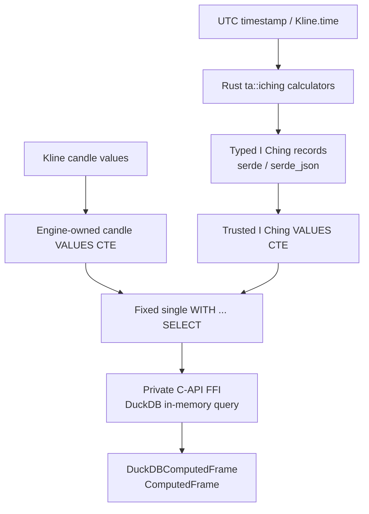
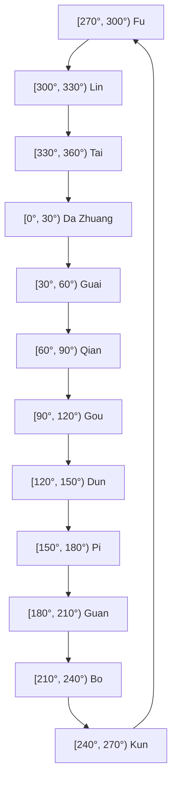

# Research & Technical Specification: I Ching Hexagram Datetime Calculation & Market Cycle Quantization

- **Target module:** `algotrap::ta::iching`
- **Category:** Technical analysis research / macro-cycle feature extraction
- **Status:** Research specification; implementation is pending explicit domain-validation and acceptance gates. Nothing in this document claims that the feature is implemented.
- **Rust dependencies:** `chrono` for UTC instants, calendar fields, and epoch conversion; `serde` with derive support and `serde_json` for typed records, nullable values, and the existing frame serialization contract.
- **Runtime dependency:** The engine-owned `libduckdb` shared library, loaded through the existing private C-API FFI. When set, `DUCKDB_LIBRARY_PATH` must be nonempty, absolute, and identify a regular file. Compatibility is established afterward by dynamic loading and required C-API symbol resolution; override validation does not prevalidate readability or architecture.
- **Database constraint:** DuckDB is an in-memory, read-only execution utility for this feature. There is no networked database, persistent DuckDB file, remote table, `ATTACH`, HTTP extension, or database connection pool in scope.

> **Scientific caveat:** Every output specified here is an experimental, deterministic feature derived from a selected calendar or hexagram convention. It is not a market prediction, a causal explanation, or trading advice.

## 1. Objective and Scope

### 1.1 Objective

Define deterministic, testable interfaces for producing I Ching-derived records from UTC timestamps and joining those records to the existing time-indexed candle frame. The design preserves the following research traditions while keeping their semantics separate:

1. **Plum Blossom (`Mei Hua Yi Shu`):** a discrete time-casting method with an explicit moving line, transformed hexagram, and mutual/nuclear hexagram.
2. **Gua Qi / Twelve Sovereigns:** a solar-ecliptic sector classification using twelve tidal hexagrams.
3. **Fu Xi circular wheel:** a 64-hexagram angular quantizer with a separate geometric line position.

The core must make the method, calendar inputs, line convention, null policy, and signal policy visible in the record. No method may silently borrow moving-line semantics from another method.

### 1.2 Non-goals

- Establishing that I Ching features predict returns, volatility, or turning points.
- Selecting a culturally authoritative lunar-calendar or 64-hexagram wheel source without a validation decision.
- Implementing a Hilbert transform, Phase-Locking Value (PLV), or other advanced numerical method before its numerical method and dependency are approved.
- Exposing arbitrary SQL, a public database connection, or a general-purpose database adapter.

### 1.3 End-to-end shape



The calculator is Rust-pure. DuckDB only joins and projects already-calculated values with the candle frame; it is not the authority for I Ching rules.

## 2. Shared I Ching Representation

### 2.1 Canonical line and bit convention

All methods use one convention:

- `line[0]` is line 1, the bottom line; `line[5]` is line 6, the top line.
- `1` means Yang and `0` means Yin.
- A displayed six-bit string is written **top to bottom**, `line[5] ... line[0]`, so the final character represents the bottom line.
- The numeric binary index is little-endian with respect to the line array:

  $$B = \sum_{i=0}^{5} line[i] \cdot 2^i, \qquad B \in [0,63].$$

For example, Fu is bottom-to-top `[1, 0, 0, 0, 0, 0]`, displays as `000001`, and has `B = 1`. Da Zhuang is bottom-to-top `[1, 1, 1, 1, 0, 0]`, displays as `001111`, and has `B = 15`.

The lower trigram supplies `line[0..3]`; the upper trigram supplies `line[3..6]`. A `Trigram::lines()` interface therefore returns three bits in bottom-to-top order.

### 2.2 Xiantian trigram numbering

The numerology formulas use the following explicit mapping. The display column is top-to-bottom; the implementation array is bottom-to-top.

| Number | Trigram | Chinese | Display bits (top → bottom) | Lines (bottom → top) | Symbol |
| :---: | :--- | :---: | :---: | :---: | :---: |
| 1 | Qian | 乾 | `111` | `[1, 1, 1]` | ☰ |
| 2 | Dui | 兑 | `011` | `[1, 1, 0]` | ☱ |
| 3 | Li | 离 | `101` | `[1, 0, 1]` | ☲ |
| 4 | Zhen | 震 | `001` | `[1, 0, 0]` | ☳ |
| 5 | Xun | 巽 | `110` | `[0, 1, 1]` | ☴ |
| 6 | Kan | 坎 | `010` | `[0, 1, 0]` | ☵ |
| 7 | Gen | 艮 | `100` | `[0, 0, 1]` | ☶ |
| 8 | Kun | 坤 | `000` | `[0, 0, 0]` | ☷ |

Modulo-8 results use `1..=8`; remainder zero maps to 8 / Kun. `from_num` must reject or explicitly normalize invalid input rather than underflowing a zero-based integer.

### 2.3 Typed record contract

The target record is a serializable value object, not a frame-specific row type:

```rust
use serde::{Deserialize, Serialize};

#[derive(Debug, Clone, Copy, PartialEq, Eq, Serialize, Deserialize)]
pub enum IchingMethod {
    PlumBlossom,
    GuaQiSovereign,
    FuXiWheel,
}

#[derive(Debug, Clone, Serialize, Deserialize)]
pub struct IchingRecord {
    pub time_ms: i64,
    pub method: IchingMethod,
    pub solar_longitude_deg: Option<f64>,
    pub binary_index: u8,
    pub bits_top_to_bottom: String,
    pub moving_line: Option<u8>,
    pub transformed_binary_index: Option<u8>,
    pub nuclear_binary_index: Option<u8>,
    pub polarity_weighted: f64,
    pub kinetic_score: f64,
    pub discrete_derivative: Option<f64>,
}
```

The exact public field set may be split into method-specific structs, but the same semantics must remain observable. `moving_line` is one-based and bottom-to-top when present. `None` is meaningful and must not be encoded as a zero line.

## 3. Datetime-to-Hexagram Systems

### 3.1 Plum Blossom / Mei Hua Yi Shu

#### Inputs and calendar boundary

`chrono` supplies a UTC instant and Gregorian fields; it does not provide a lunar calendar. Until an approved lunar-calendar conversion dependency or fixture source is selected, the pure casting function accepts validated discrete inputs:

```rust
#[derive(Debug, Clone, Copy, PartialEq, Eq)]
pub struct PlumBlossomInput {
    pub year_branch: u8,   // 1..=12
    pub lunar_month: u8,   // 1..=12
    pub lunar_day: u8,     // validated by the selected calendar source
    pub hour_branch: u8,   // 1..=12
}
```

An adapter may derive `year_branch` and `hour_branch` from an explicitly selected civil/local-solar-time policy. The policy must document its timezone, the midnight boundary, and the 23:00–01:00 Zi wrap. A UTC timestamp must not be silently treated as local solar time. Lunar month/day conversion is a domain-validation prerequisite, not an accidental `chrono` behavior.

For a supported year `Y`, the branch convention is:

$$Y_{branch} = ((Y - 4) \bmod 12) + 1.$$

The branch numbers are `1 Zi`, `2 Chou`, `3 Yin`, `4 Mao`, `5 Chen`, `6 Si`, `7 Wu`, `8 Wei`, `9 Shen`, `10 You`, `11 Xu`, and `12 Hai`. The implementation must use a remainder operation with defined behavior for all supported Gregorian years.

#### Casting formulas

Let:

$$S_1 = Y_{branch} + M_{lunar} + D_{lunar},$$
$$S_2 = S_1 + H_{branch}.$$

Then:

1. Upper trigram number is `S1 mod 8`, with zero mapped to 8.
2. Lower trigram number is `S2 mod 8`, with zero mapped to 8.
3. Moving line is `S2 mod 6`, with zero mapped to 6, counted from bottom line 1 to top line 6.
4. The transformed hexagram flips exactly that moving line.
5. The mutual/nuclear hexagram uses original lines 2, 3, 4 as its lower trigram and original lines 3, 4, 5 as its upper trigram. These line numbers are one-based and bottom-to-top.

Plum Blossom is the only default method in this document that produces a moving line and transformed hexagram. The kinetic score and kinetic turn-point rule in §4 are therefore defined for this method first.

### 3.2 Astronomical Gua Qi and the Twelve Sovereigns

The Gua Qi method maps normalized solar ecliptic longitude `lambda_sun` in `[0°, 360°)` to twelve 30-degree half-open sectors. The following deterministic approximation is the specified research baseline; its astronomical error tolerance must be validated before production use.

Given Julian Day `JD`:

$$T = \frac{JD - 2451545.0}{36525},$$
$$L_0 = 280.46646 + 36000.76983T + 0.0003032T^2,$$
$$M = 357.52911 + 35999.05029T - 0.0001537T^2,$$
$$C = (1.914602 - 0.004817T)\sin(M) + 0.019993\sin(2M) + 0.000289\sin(3M),$$
$$\lambda_{sun} = \operatorname{rem_euclid}(L_0 + C, 360).$$

The trigonometric arguments use radians after the degree-valued angles are normalized. The Julian-day adapter includes the UTC time-of-day fraction. It must normalize negative intermediate values with Euclidean remainder, not language-specific truncating remainder.

#### Sovereign cycle diagram

The cycle is read clockwise in increasing normalized longitude, beginning at the winter-solstice boundary. Each interval is half-open, and the final interval wraps to 270°.



#### Exact sector table

| Sector, half-open | Boundary value | Sovereign hexagram | Symbol | Bits (top → bottom) | Yang lines | Research regime label |
| :--- | :---: | :--- | :---: | :---: | :---: | :--- |
| `[270°, 300°)` | 270° | Fu (復) | ䷗ | `000001` | 1/6 | Reversal / first Yang |
| `[300°, 330°)` | 300° | Lin (臨) | ䷒ | `000011` | 2/6 | Approach / accumulation |
| `[330°, 360°)` | 330° | Tai (泰) | ䷊ | `000111` | 3/6 | Expansion / accord |
| `[0°, 30°)` | 0° | Da Zhuang (大壯) | ䷡ | `001111` | 4/6 | Strong expansion |
| `[30°, 60°)` | 30° | Guai (夬) | ䷪ | `011111` | 5/6 | Decisive excess |
| `[60°, 90°)` | 60° | Qian (乾) | ䷀ | `111111` | 6/6 | Full Yang |
| `[90°, 120°)` | 90° | Gou (姤) | ䷫ | `111110` | 5/6 | First Yin |
| `[120°, 150°)` | 120° | Dun (遁) | ䷠ | `111100` | 4/6 | Withdrawal |
| `[150°, 180°)` | 150° | Pi (否) | ䷋ | `111000` | 3/6 | Stagnation |
| `[180°, 210°)` | 180° | Guan (觀) | ䷓ | `110000` | 2/6 | Observation / contraction |
| `[210°, 240°)` | 210° | Bo (剝) | ䷖ | `100000` | 1/6 | Stripping / exhaustion |
| `[240°, 270°)` | 240° | Kun (坤) | ䷁ | `000000` | 0/6 | Full Yin |

The canonical values are the name, sector, and bit string; glyph rendering is presentation-only.

The sector function is:

```text
lambda_norm = rem_euclid(lambda_sun, 360.0)
offset      = rem_euclid(lambda_norm - 270.0, 360.0)
sector      = floor(offset / 30.0) as usize       // 0..=11
```

Sector indices `0..=11` map to `Fu, Lin, Tai, Da Zhuang, Guai, Qian, Gou, Dun, Pi, Guan, Bo, Kun` in that order. The implementation must use half-open comparisons: `270° → Fu`, `300° → Lin`, `330° → Tai`, `0° → Da Zhuang`, `30° → Guai`, `60° → Qian`, `90° → Gou`, `120° → Dun`, `150° → Pi`, `180° → Guan`, `210° → Bo`, and `240° → Kun`. An input of `360°` is first normalized to `0°` and therefore maps to **Da Zhuang**, not Fu. The canonical solar-longitude output is always in `[0°, 360°)`.

#### Floating-boundary policy

Use `epsilon = 1e-12°` for floating-point boundary stabilization. After `rem_euclid` normalization, if a value is within `epsilon` of a declared sector boundary (including the circular `0°/360°` boundary), snap it to that exact boundary before applying the unchanged half-open mapping. Every boundary remains lower-inclusive and upper-exclusive, so an exact boundary belongs to the sector that begins there. Values farther than `epsilon` from a boundary use the raw normalized value; epsilon does not change the sector order or core mapping.

Sovereign Gua Qi records always have no moving line, no transformed hexagram, and no kinetic event. Only a separately specified solar-wheel moving-line model may introduce one; that model is explicitly out of scope.

For every sovereign record:

- `moving_line = None`;
- `transformed_binary_index = None`;
- `kinetic_score = 0.0`.

Crossing from Qian to Gou or Kun to Fu can be emitted as a descriptive sector-boundary label. It is not a moving-line event and is not a predictive signal.

### 3.3 Fu Xi circular wheel

The wheel is a separate angular quantizer, not a refinement of the twelve-sector assignment:

$$\Delta\theta_{hexagram} = \frac{360°}{64} = 5.625°,$$
$$\Delta\theta_{line} = \frac{5.625°}{6} = 0.9375°.$$

For normalized longitude:

$$\theta = \operatorname{rem_euclid}(\lambda_{sun} - 270°, 360°),$$
$$hexagram\_index = \left\lfloor \frac{\theta}{5.625°} \right\rfloor,$$
$$line\_index = \left\lfloor \frac{\operatorname{rem}(\theta, 5.625°)}{0.9375°} \right\rfloor.$$

The index ranges are `hexagram_index ∈ 0..=63` and `line_index ∈ 0..=5`. The 64-entry Fu Xi order must be an explicit, approved table in the implementation; this document does not assert an unvalidated cultural ordering. `line_index + 1` is a geometric wheel position, **not** `moving_line`. It must not affect kinetic score. A solar-wheel moving-line model is explicitly out of scope.

For wheel floating-point boundaries, use the same `epsilon = 1e-12°` policy: after normalizing `theta`, snap values within epsilon of a hexagram boundary (`k * 5.625°`) or line boundary (`k * 0.9375°`) to that exact boundary, then apply the unchanged half-open bins. Thus a boundary is included in the bin beginning at that boundary, and `theta = 360°` remains normalized to `0°`; values outside epsilon are classified by the raw floor formulas.

## 4. Quantization and Signal Semantics

### 4.1 Polarity and binary metrics

For `y_i ∈ {0,1}` in bottom-to-top order:

$$P_{unweighted} = \frac{\sum_{i=1}^{6} y_i - 3}{3} \in [-1,1].$$

The research default weighted metric uses the explicit bottom-to-top weights:

```text
w = [0.10, 0.20, 0.15, 0.15, 0.30, 0.10]
```

The weights sum to 1.0 and define:

$$P_{weighted} = \sum_{i=1}^{6} w_i(2y_i - 1) \in [-1,1].$$

The binary index is `B` from §2.1. A percentage display, if needed by a consumer, is `100 * B / 63`; it is presentation-only and is not a second state definition.

### 4.2 Optional Wu Xing research metric

The trigram-to-element mapping is explicit: Qian/Dui → Metal, Zhen/Xun → Wood, Kan → Water, Li → Fire, and Gen/Kun → Earth. If an elemental relation is retained, it uses a named, versioned relation matrix rather than an implicit narrative:

- generating relation: `+1.0`;
- same-element consonance: `0.0`;
- draining relation: `-0.3`;
- overcoming relation: `-1.0`.

The direction (`upper` relative to `lower`, or the inverse) must be a function argument or an enum variant. This metric is an experimental categorical encoding and has no efficacy interpretation.

### 4.3 Moving-line and kinetic policy

The kinetic score is source-specific:

$$K_{plum} = |P_{weighted}(H_{trans}) - P_{weighted}(H_{orig})|
  + 0.3\,I_{moving\_line=5}
  + 0.2\,I_{moving\_line=6}.$$

For Plum Blossom, the score is finite and non-negative. For Gua Qi Sovereigns, `moving_line=None`, `transformed_binary_index=None`, and `K=0.0` are mandatory. For the Fu Xi wheel, the geometric line position is not a moving line and `K=0.0`. No method may infer a moving line merely because a sector or wheel bin changed; a solar-wheel moving-line model is explicitly out of scope.

### 4.4 Ordering, duplicates, nulls, and discrete derivative

The sequence contract is explicit:

1. **Order policy:** The default is `RejectOutOfOrder`. Every `Kline.time` used for a signal must be strictly increasing after duplicate handling. An explicit `SortAscending` policy may stable-sort rows by timestamp before calculation; it must be recorded in test fixtures and must not be silently selected by an adapter.
2. **Duplicate policy:** The default is `RejectDuplicates`. An explicit `KeepFirst` or `KeepLast` policy may collapse equal timestamps before calculation. `KeepFirst` and `KeepLast` refer to the original stable input order. A duplicate must never be used as a derivative denominator.
3. **Source timestamp:** `Kline.time` is non-null `i64`. The engine integration rejects source rows with null or unparseable timestamps before constructing `Kline`; it does not convert them to epoch zero, construct a null-time `Kline`, or promise to preserve them. If a nullable ingestion row is designed later, it must be a separate pre-`Kline` ingestion type with an explicitly documented reject/quarantine/propagation policy; that is a future extension and is out of scope here.
4. **Null signal:** A null polarity or source value produces a null derivative for that row and resets the derivative chain. Null is not the numeric value zero.
5. **Derivative:** For row `i`, with millisecond timestamps and weighted polarity `P`:

   $$D_i = \frac{P_i - P_{i-1}}{(t_i - t_{i-1}) / 1000}.$$

   `D_i = null` for the first row, a null signal, or any non-positive time delta. Under the current `Kline` contract there is no nullable timestamp row in the sequence. After `RejectOutOfOrder` or an explicit stable sort, a non-positive delta is an error rather than a silently repaired value.
6. **Finite contract:** Every present numeric output must be finite. `NaN`, positive infinity, and negative infinity are rejected before SQL or JSON serialization. Optional values are represented as `NULL` in DuckDB and `null` in JSON.

### 4.5 Turn-point labels and correlation research

Turn-point labels are descriptive research annotations, not trading signals. The default polarity labels are evaluated only on Plum Blossom records unless a separate method policy is approved:

- `P_weighted >= 0.85` and `D < 0` → `TopExhaustionLabel`;
- `P_weighted <= -0.85` and `D > 0` → `BottomCapitulationLabel`;
- `K >= 0.4` → `KineticChangeLabel`, only when the source is Plum Blossom.

Qian→Gou and Kun→Fu are sovereign boundary annotations and must not be fed into the Plum Blossom kinetic rule. Any later lead/lag correlation must use a declared time window, an explicit lag sign convention, finite-value filtering, and no look-ahead.

The Hilbert-transform PLV implementation is **deferred**. It may be designed only after an approved numerical method, edge-treatment policy, precision policy, and dependency are selected. A formula in a research note is not an implementation dependency or an acceptance claim.

## 5. Architecture and DuckDB Integration

### 5.1 Target module boundaries

The target layout is a plan, not a claim that these modules currently exist:

```text
src/ta/iching/
├── mod.rs              # Public, typed calculator and record exports
├── types.rs            # Line, trigram, hexagram, method, and policy types
├── plum_blossom.rs     # Explicit-input casting and transformations
├── gua_qi.rs           # JD, solar longitude, and twelve-sector mapping
├── solar_wheel.rs      # 64-bin angular mapping and approved wheel order
├── quantization.rs     # Polarity, binary, Wu Xing, and kinetic metrics
└── signals.rs          # Ordering, duplicate, derivative, and label policies

src/engine/duckdb_engine.rs  # Fixed SQL builder and ComputedFrame integration
src/engine/duckdb_ffi.rs     # Existing private, read-only C-API boundary
```

The `ta::iching` core imports only standard Rust types plus the approved `chrono`, `serde`, and `serde_json` APIs. It must not import the engine, FFI, SQL builder, or frame implementation. The engine owns the adapter because it already owns `Kline` ingestion, fixed SQL generation, and `DuckDBComputedFrame` materialization.

### 5.2 Existing engine conventions to preserve

- `Kline.time` is UTC epoch milliseconds and is the join key.
- The engine obtains the shared API through the private `duckdb_api()` singleton.
- `DuckDbApi::query_to_json` executes one internal read-only query against an in-memory database and returns JSON text.
- `DuckDBComputedFrame::from_json(&json, columns)` materializes the existing `ComputedFrame` contract.
- Missing numeric values stay `serde_json::Value::Null`; `ComputedFrame::f64_at` returns `Ok(None)` for them.
- The engine returns named columns through `ComputedFrame`; downstream consumers do not receive a database handle or a backend-specific table object.

The FFI currently exposes query execution and typed result extraction only. It does **not** expose prepared statements, native function registration, or Rust UDF registration. This specification must not add an assumed registration path.

### 5.3 Safe join design

The engine integration proceeds as follows:

1. Validate the candle slice and finite numeric inputs using existing engine error conventions.
2. Convert each `Kline.time` with a checked UTC epoch-millisecond conversion.
3. Calculate I Ching values in Rust and retain them as typed `IchingRecord` values.
4. Build a single engine-owned SQL string containing:
   - the existing candle `VALUES`/derived-data CTE;
   - a trusted I Ching `VALUES` CTE containing only Rust-calculated scalar values; and
   - a fixed-column `LEFT JOIN` on `time`, followed by the fixed projection and `ORDER BY time`.
5. Execute that query through `query_to_json` and construct `DuckDBComputedFrame` with the fixed output-column list.

The SQL builder owns every identifier and alias. User-derived identifiers never enter SQL: no caller-supplied timestamp column name, ticker text, indicator name, or JSON key is interpolated as an identifier. Runtime values are rendered only as checked numeric literals or `NULL`; any future string value must use a dedicated literal encoder and a fixed enum vocabulary. The FFI remains the final defense-in-depth check for a single `WITH`/`SELECT` read-only statement without semicolons or destructive keywords.

Illustrative SQL shape:

```sql
WITH
klines(open, high, low, close, volume, time, adj_close) AS (
    -- Existing engine-owned build_klines_values_cte supplies this CTE.
    VALUES (...)
),
iching(time, iching_binary_index, iching_polarity, iching_kinetic, iching_moving_line) AS (
    VALUES
        (1700000000000, 1,  -0.8, 0.0, NULL),
        (1700000060000, 15, 0.2,  0.0, NULL)
)
SELECT
    klines.time,
    klines.open,
    klines.high,
    klines.low,
    klines.close,
    klines.volume,
    klines.adj_close,
    iching.iching_binary_index,
    iching.iching_polarity,
    iching.iching_kinetic,
    iching.iching_moving_line
FROM klines
LEFT JOIN iching ON klines.time = iching.time
ORDER BY klines.time
```

The example values are illustrative only. The production builder must render actual checked Rust values and must not accept arbitrary SQL fragments.

### 5.4 Rust interface and integration sketch

The following is a concise implementation-shaped interface. It is a design sketch, not an assertion that the functions already exist:

```rust
use chrono::{DateTime, TimeZone, Utc};
use serde_json::{Map, Value};

use crate::engine::duckdb_ffi::DuckDbApi;
use crate::engine::error::MarketError;
// This sketch is placed in the engine module, beside query_frame and
// DuckDBComputedFrame, so it uses the existing private helpers directly.
use crate::model::kline::Kline;
use crate::ta::iching::{IchingRecord, record_from_utc};

fn records_as_json(
    records: &[IchingRecord],
) -> Result<Vec<Map<String, Value>>, serde_json::Error> {
    records
        .iter()
        .map(|record| serde_json::to_value(record).and_then(serde_json::from_value))
        .collect()
}

fn compute_iching_frame(
    api: &DuckDbApi,
    klines: &[Kline],
) -> Result<DuckDBComputedFrame, MarketError> {
    let records = klines
        .iter()
        .map(|kline| {
            let timestamp: DateTime<Utc> = Utc
                .timestamp_millis_opt(kline.time)
                .single()
                .ok_or_else(|| MarketError::validation("invalid UTC epoch millisecond"))?;
            record_from_utc(timestamp)
                .map_err(|error| MarketError::computation(error.to_string()))
        })
        .collect::<Result<Vec<_>, _>>()?;

    let _json_records = records_as_json(&records)
        .map_err(|error| MarketError::computation(error.to_string()))?;
    let sql = build_iching_join_sql(klines, &records)?;
    query_frame(api, &sql, iching_output_columns())
}
```

The `query_frame` call above uses the existing engine convention: query JSON through the private API, then call `DuckDBComputedFrame::from_json`. `records_as_json` is for the repository's serializable-record and fixture contract; the SQL builder must still render typed, finite values into its trusted `VALUES` CTE rather than treating JSON as SQL.

A fixed builder can be shaped as follows:

```rust
fn build_iching_join_sql(
    klines: &[Kline],
    records: &[IchingRecord],
) -> Result<String, MarketError> {
    let klines_cte = build_klines_values_cte(klines);
    let iching_rows = records
        .iter()
        .map(render_iching_values_row)
        .collect::<Result<Vec<_>, MarketError>>()?
        .join(",\n        ");

    Ok(format!(
        r#"WITH {klines_cte},
iching(time, iching_binary_index, iching_polarity, iching_kinetic, iching_moving_line) AS (VALUES
        {iching_rows}
)
SELECT klines.time, klines.open, klines.high, klines.low, klines.close,
       klines.volume, klines.adj_close, iching.iching_binary_index,
       iching.iching_polarity, iching.iching_kinetic, iching.iching_moving_line
FROM klines LEFT JOIN iching ON klines.time = iching.time
ORDER BY klines.time"#
    ))
}
```

The helper emits the `klines(...)` relation shown above; the sketch therefore uses `klines` consistently and does not invent a `candles` relation or alias. The exact existing candle CTE may be composed into the engine's current recursive indicator query rather than copied. The invariants are fixed identifiers, one statement, no caller SQL, and the I Ching join occurring after Rust calculation.

### 5.5 Runtime constraints

- When set, `DUCKDB_LIBRARY_PATH` is validated only for nonempty, absolute, regular-file shape before dynamic loading. Dynamic loading and required C-API symbol resolution then establish whether the selected library is compatible; path validation does not prevalidate readability or architecture.
- If the variable is unset, the existing platform loader-name fallback may be used according to the engine contract; this is still a local shared library, not a network lookup.
- The runtime opens `:memory:` only. A missing or incompatible library is an explicit typed error; it is not a reason to select another compute backend.
- SQL is fixed and read-only. The current FFI rejects empty SQL, semicolon-separated statements, and destructive statement keywords. The I Ching integration must remain inside that capability boundary.
- No dependency on a server, networked database, downloaded extension, persistent database file, or runtime SQL function registration is required.

### 5.6 Future extension: native DuckDB function registration

**Not part of this implementation.** If native DuckDB scalar/table function registration is later designed, it must begin with an explicit FFI capability and an ABI/lifetime/thread-safety review. The extension would need:

1. a versioned C-API surface for registration and callback ownership;
2. a proof that callbacks cannot outlive the Rust-owned calculator state;
3. fixed argument and nullability contracts;
4. parity tests against the Rust-pure calculator; and
5. a decision on whether registration remains private and read-only.

Until those gates pass, no UDF registration is assumed and the trusted derived-data CTE join is the only integration design.

## 6. Staged Implementation and Machine-Verifiable Acceptance

### Stage 0 — Domain and contract freeze

Approve the lunar-calendar input source, solar-longitude tolerance, Gregorian/UTC conversion behavior, and the 64-entry wheel order. Record each decision in fixtures or versioned policy types. The data-source approval gate **passes only if** the selected lunar-calendar source/version, solar reference or expected-longitude fixture source/version, `1e-9°` non-boundary tolerance, and approved 64-entry wheel-order table are all recorded. It **fails** if any source, version, tolerance, or table is missing; implementation must stop rather than silently substituting one.

### Stage 1 — Rust-pure calculator

Implement and test `ta::iching` without engine or DuckDB imports.

Machine-verifiable acceptance:

- Trigram round trips preserve the bottom-to-top line array and the top-to-bottom display string.
- All twelve sovereign fixtures match the exact sectors, bit strings, Yang counts, and binary indices in §3.2.
- Boundary fixtures assert `270°→Fu`, `300°→Lin`, `330°→Tai`, `0°→Da Zhuang`, `30°→Guai`, `60°→Qian`, `90°→Gou`, `120°→Dun`, `150°→Pi`, `180°→Guan`, `210°→Bo`, and `240°→Kun`.
- A `360°` input normalizes to `0°` and returns Da Zhuang; no fixture maps `360°` to Fu.
- Non-boundary representative UTC fixtures compare calculated solar longitude with frozen expected values using `abs(actual - expected) <= 1e-9°`; each fixture must be outside the `1e-12°` boundary-stabilization epsilon and must return the exact expected sector.
- Boundary fixtures use this exact expected table, with no tolerance-based sector substitution:

  | Normalized longitude | Sovereign | Bits (top → bottom) |
  | :---: | :--- | :---: |
  | `270°` | Fu | `000001` |
  | `300°` | Lin | `000011` |
  | `330°` | Tai | `000111` |
  | `0°` | Da Zhuang | `001111` |
  | `30°` | Guai | `011111` |
  | `60°` | Qian | `111111` |
  | `90°` | Gou | `111110` |
  | `120°` | Dun | `111100` |
  | `150°` | Pi | `111000` |
  | `180°` | Guan | `110000` |
  | `210°` | Bo | `100000` |
  | `240°` | Kun | `000000` |

- Fixed expected UTC fixtures for the selected winter solstice, spring equinox, summer solstice, and autumn equinox inputs return Fu, Da Zhuang, Gou, and Guan respectively, subject to the `1e-9°` non-boundary tolerance when the fixture is not a boundary case.
- Plum Blossom fixtures verify moving-line calculation, bottom-to-top flipping, transformed hexagram, and mutual/nuclear line selection.
- Sovereign fixtures verify `moving_line=None` and `kinetic_score=0.0`.
- Wheel fixtures verify 64-bin and six-position half-open behavior without converting geometric position into a moving line.

The exact unit-test gate is:

```text
cargo test -p algotrap --lib ta::iching -- --nocapture
```

It passes only when the command exits `0`, reports at least one I Ching test, and all listed fixtures—including the `1e-9°` non-boundary comparisons and the exact boundary table—pass. A nonzero exit, zero matching tests, or any failed assertion is a gate failure.

### Stage 2 — Signal and serialization contract

Machine-verifiable acceptance:

- Tests cover first-row, source-row null/unparseable timestamp rejection before `Kline` construction, null-signal, out-of-order, duplicate, and zero/negative-delta cases. No current test preserves a null-time `Kline`; a future nullable-ingestion extension would require its own contract and fixtures.
- `RejectOutOfOrder`, stable `SortAscending`, `RejectDuplicates`, `KeepFirst`, and `KeepLast` produce the documented results.
- Derivatives use seconds from epoch milliseconds and never divide by zero.
- Every present numeric output is finite; optional outputs serialize as JSON `null` and DuckDB `NULL`.
- `serde_json` round trips preserve field names, `moving_line=None`, and nullable values without `NaN` or infinity.

### Stage 3 — DuckDB engine integration

Machine-verifiable acceptance:

- The integration uses only the existing private, read-only C-API FFI and `DuckDBComputedFrame`/`ComputedFrame` conventions.
- A runtime test with a local shared library selected by `DUCKDB_LIBRARY_PATH` opens DuckDB in memory, executes the fixed join, and returns the expected JSON records and columns. Runtime availability **passes only if** dynamic loading, required C-API symbol resolution, the in-memory query, and result assertions all succeed; it **fails** on an unset fallback that cannot load, an invalid override, a load/symbol error, a query error, or a result mismatch.
- The generated SQL contains only engine-owned identifiers, one `WITH`/`SELECT` statement, checked `VALUES` data, a time join, and the fixed projection.
- Tests prove null preservation and row-order preservation through the `ComputedFrame` accessors.
- No networked database, persistent database, arbitrary SQL input, or function-registration capability is required.

The exact integration and runtime gates are:

```text
DUCKDB_LIBRARY_PATH=/opt/homebrew/lib/libduckdb.dylib cargo test -p algotrap --lib engine::duckdb_engine::tests::iching_join_preserves_nulls_and_order -- --exact --nocapture
DUCKDB_LIBRARY_PATH=/opt/homebrew/lib/libduckdb.dylib cargo test -p algotrap --lib engine::duckdb_ffi::tests::duckdb_runtime_contract -- --exact --ignored --nocapture
```

The integration command must report exactly one passing named test and no failures. The runtime command must report exactly one passing ignored test and no failures; otherwise runtime availability is not approved. The explicit path is an example of the configured local override used by the repository's runtime gate; the test must still exercise the current nonempty/absolute/regular-file validation followed by dynamic loading and symbol resolution.

### Stage 4 — Repository and quality gate

Machine-verifiable acceptance:

- `cargo fmt --check` passes.
- Focused pure-core tests pass without network access.
- The local DuckDB runtime contract passes with the configured `DUCKDB_LIBRARY_PATH` under the Stage 3 runtime command; if no candidate can be dynamically loaded and resolve the required symbols, this gate fails rather than selecting another backend.
- The exact obsolete-coupling search gate is:

  ```text
  rg -n --glob '*.rs' '(?i)(iching.{0,80}(polars|dataframe|expr)|(polars|dataframe|expr).{0,80}iching)' src >/tmp/iching-obsolete-search.txt; test $? -eq 1
  ```

  It passes only when `rg` finds no match (the final `test` exits `0`); a match or search error fails the gate.
- The feature has one DuckDB engine path and no compatibility branch for another table-computation backend.

### Stage 5 — Explicit non-causal market-efficacy gate

This gate is separate from deterministic calculator correctness and cannot block the core feature by claiming predictive success. If a later research task evaluates market association, it must be explicitly non-causal:

- use only information available at each timestamp, with no look-ahead;
- preserve chronological train/holdout separation;
- declare lag direction, sampling, missing-data treatment, costs, and multiple-hypothesis controls;
- report null, negative, and unstable results; and
- prohibit conversion of an association or backtest result into a market prediction or trading advice.

PLV/Hilbert work remains deferred until the numerical method and dependency are approved. A passing backtest is neither required nor sufficient for acceptance of the deterministic feature.
