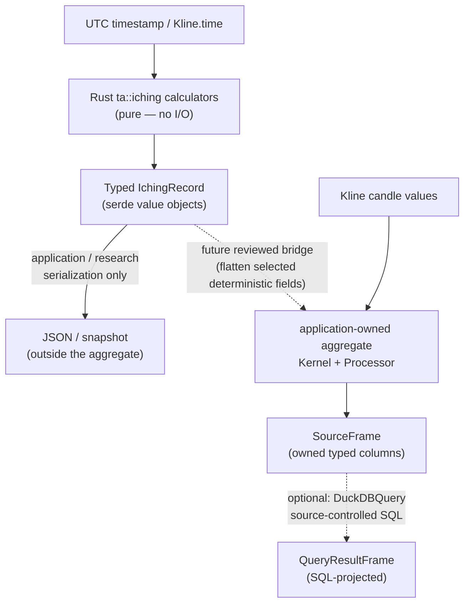
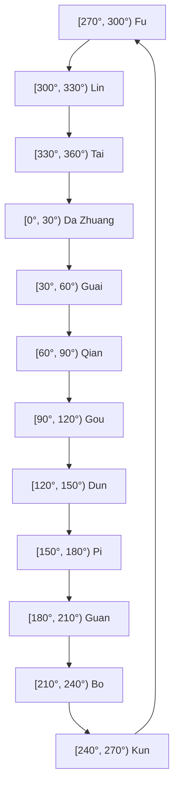

# Research & Technical Specification: I Ching Hexagram Datetime Calculation & Market Cycle Quantization

> **Planned / Not Implemented**
>
> This document describes a **planned** feature that does not currently exist in the
> codebase. No `src/ta/iching`, `src/ext/lunar`, `src/iching`, or `bins/iching`
> implementation currently exists. All module layouts, API names, data shapes,
> snapshot schemas, verification commands, and integration paths below are
> **proposed target state** and remain provisional until the root library contracts are stabilized and a follow-up design review is completed.
>
> **Blocked on:** root library stabilization (typed `Kernel`/`Processor`/`PriorState` contracts, `SourceFrame`/`QueryResultFrame` column semantics, `DuckDBQuery` projection seam, and `Kline.time` timestamp-unit resolution).
>
> **Current architecture references:** [docs/architecture.md](../../../docs/architecture.md) · [src/README.md](../../../src/README.md) · [docs/architecture/stream-and-duckdb-data-flow.md](../../../docs/architecture/stream-and-duckdb-data-flow.md)

- **Target module:** `algotrap::ta::iching` (proposed)
- **Category:** Technical analysis research / macro-cycle feature extraction
- **Status:** Planned. This feature is intentionally blocked on root library stabilization. No implementation, tests, binary, or verification gates currently exist.
- **Rust dependencies:** `chrono` for UTC instants, calendar fields, and epoch conversion; `serde` with derive support and `serde_json` for typed records and nullable values.
- **Integration path (proposed):** Pure deterministic I-Ching calculations in `src/ta` produce typed `IchingRecord` value objects outside the aggregate. The root aggregate contract currently supports only nullable Number/Boolean scalar inputs and outputs; a complete record cannot currently flow through the aggregate (documented blocker). A future reviewed bridge must flatten selected deterministic fields into scalar aggregate inputs/outputs or keep records outside the aggregate. Optional source-controlled SQL projection through `DuckDBQuery` to `QueryResultFrame`. Application/CLI owns input loading and presentation. DuckDB does not own I-Ching computation.

> **Scientific caveat:** Every output specified here is an experimental, deterministic feature derived from a selected calendar or hexagram convention. It is not a market prediction, a causal explanation, or trading advice.

## 1. Objective and Scope

### 1.1 Objective

Define deterministic, testable interfaces for producing I Ching-derived records from UTC timestamps and joining those records to the existing time-indexed candle frame. The design preserves the following research traditions while keeping their semantics separate:

1. **Plum Blossom (`Mei Hua Yi Shu`):** a discrete time-casting method with an explicit moving line, transformed hexagram, and mutual/nuclear hexagram.
2. **Gua Qi / Twelve Sovereigns:** a solar-ecliptic sector classification using twelve tidal hexagrams.
3. **Fu Xi circular wheel:** a 64-hexagram angular quantizer with a separate geometric line position.

The core must make the method, calendar inputs, line convention, null policy, and signal policy visible in the record. No method may silently borrow moving-line semantics from another method.

### 1.2 Non-goals

- Establishing that I Ching features predict returns, volatility, or turning points.
- Selecting a culturally authoritative lunar-calendar or 64-hexagram wheel source without a validation decision.
- Implementing a Hilbert transform, Phase-Locking Value (PLV), or other advanced numerical method before its numerical method and dependency are approved.
- Exposing arbitrary SQL, a public database connection, or a general-purpose database adapter.

### 1.3 End-to-end shape (proposed target state)



The calculator is Rust-pure and lives in `src/ta`. A complete typed `IchingRecord` is **not** a current aggregate input/output: the root aggregate contract supports only nullable Number/Boolean scalar inputs and outputs. A whole record cannot flow through the aggregate today; that is a documented blocker/constraint. DuckDB is available only as an optional downstream SQL projection adapter — it is not the authority for I Ching rules.

## 2. Shared I Ching Representation

### 2.1 Canonical line and bit convention

All methods use one convention:

- `line[0]` is line 1, the bottom line; `line[5]` is line 6, the top line.
- `1` means Yang and `0` means Yin.
- A displayed six-bit string is written **top to bottom**, `line[5] ... line[0]`, so the final character represents the bottom line.
- The numeric binary index is little-endian with respect to the line array:

  $$B = \sum_{i=0}^{5} line[i] \cdot 2^i, \qquad B \in [0,63].$$

For example, Fu is bottom-to-top `[1, 0, 0, 0, 0, 0]`, displays as `000001`, and has `B = 1`. Da Zhuang is bottom-to-top `[1, 1, 1, 1, 0, 0]`, displays as `001111`, and has `B = 15`.

The lower trigram supplies `line[0..3]`; the upper trigram supplies `line[3..6]`. A `Trigram::lines()` interface therefore returns three bits in bottom-to-top order.

### 2.2 Xiantian trigram numbering

The numerology formulas use the following explicit mapping. The display column is top-to-bottom; the implementation array is bottom-to-top.

| Number | Trigram | Chinese | Display bits (top → bottom) | Lines (bottom → top) | Symbol |
| :---: | :--- | :---: | :---: | :---: | :---: |
| 1 | Qian | 乾 | `111` | `[1, 1, 1]` | ☰ |
| 2 | Dui | 兑 | `011` | `[1, 1, 0]` | ☱ |
| 3 | Li | 离 | `101` | `[1, 0, 1]` | ☲ |
| 4 | Zhen | 震 | `001` | `[1, 0, 0]` | ☳ |
| 5 | Xun | 巽 | `110` | `[0, 1, 1]` | ☴ |
| 6 | Kan | 坎 | `010` | `[0, 1, 0]` | ☵ |
| 7 | Gen | 艮 | `100` | `[0, 0, 1]` | ☶ |
| 8 | Kun | 坤 | `000` | `[0, 0, 0]` | ☷ |

Modulo-8 results use `1..=8`; remainder zero maps to 8 / Kun. `from_num` must reject or explicitly normalize invalid input rather than underflowing a zero-based integer.

### 2.3 Typed record contract

The target record is a serializable value object, not a frame-specific row type:

```rust
use serde::{Deserialize, Serialize};

#[derive(Debug, Clone, Copy, PartialEq, Eq, Serialize, Deserialize)]
pub enum IchingMethod {
    PlumBlossom,
    GuaQiSovereign,
    FuXiWheel,
}

#[derive(Debug, Clone, Serialize, Deserialize)]
pub struct IchingRecord {
    pub time_ms: i64,
    pub method: IchingMethod,
    pub solar_longitude_deg: Option<f64>,
    pub binary_index: u8,
    pub bits_top_to_bottom: String,
    pub moving_line: Option<u8>,
    pub transformed_binary_index: Option<u8>,
    pub nuclear_binary_index: Option<u8>,
    pub polarity_weighted: f64,
    pub kinetic_score: f64,
    pub discrete_derivative: Option<f64>,
}
```

> **Provisional.** The exact public field set may be split into method-specific structs, but the same semantics must remain observable. The `time_ms` field name and timestamp unit (milliseconds assumed) are provisional — they depend on the resolved `Kline.time` contract in the root library.

`moving_line` is one-based and bottom-to-top when present. `None` is meaningful and must not be encoded as a zero line.

## 3. Datetime-to-Hexagram Systems

### 3.1 Plum Blossom / Mei Hua Yi Shu

#### Inputs and calendar boundary

`chrono` supplies a UTC instant and Gregorian fields; it does not provide a lunar calendar. The pure casting function accepts validated discrete inputs; the responsibility for resolving a UTC candle timestamp into those inputs belongs to a method-scoped adapter. That adapter is gated separately from Gua Qi and Fu Xi (see Stage 0b in §6 and [`docs/architecture/iching-lunar-calendar-integration.md`](../../architecture/iching-lunar-calendar-integration.md) for the adapter module layout, time policy, and invariants). The pure-core interface is:

```rust
#[derive(Debug, Clone, Copy, PartialEq, Eq)]
pub struct PlumBlossomInput {
    pub year_branch: u8,   // 1..=12
    pub lunar_month: u8,   // 1..=12
    pub lunar_day: u8,     // validated by the selected calendar source
    pub hour_branch: u8,   // 1..=12
}
```

An adapter may derive `year_branch` and `hour_branch` from an explicitly selected civil/local-solar-time policy. The policy must document its timezone, the midnight boundary, and the 23:00–01:00 Zi wrap. A UTC timestamp must not be silently treated as local solar time. Lunar month/day conversion is a domain-validation prerequisite, not an accidental `chrono` behavior.

For a supported year `Y`, the branch convention is:

$$Y_{branch} = ((Y - 4) \bmod 12) + 1.$$

The branch numbers are `1 Zi`, `2 Chou`, `3 Yin`, `4 Mao`, `5 Chen`, `6 Si`, `7 Wu`, `8 Wei`, `9 Shen`, `10 You`, `11 Xu`, and `12 Hai`. The implementation must use a remainder operation with defined behavior for all supported Gregorian years.

#### Casting formulas

Let:

$$S_1 = Y_{branch} + M_{lunar} + D_{lunar},$$
$$S_2 = S_1 + H_{branch}.$$

Then:

1. Upper trigram number is `S1 mod 8`, with zero mapped to 8.
2. Lower trigram number is `S2 mod 8`, with zero mapped to 8.
3. Moving line is `S2 mod 6`, with zero mapped to 6, counted from bottom line 1 to top line 6.
4. The transformed hexagram flips exactly that moving line.
5. The mutual/nuclear hexagram uses original lines 2, 3, 4 as its lower trigram and original lines 3, 4, 5 as its upper trigram. These line numbers are one-based and bottom-to-top.

Plum Blossom is the only default method in this document that produces a moving line and transformed hexagram. The kinetic score and kinetic turn-point rule in §4 are therefore defined for this method first.

### 3.2 Astronomical Gua Qi and the Twelve Sovereigns

The Gua Qi method maps normalized solar ecliptic longitude `lambda_sun` in `[0°, 360°)` to twelve 30-degree half-open sectors. The following deterministic approximation is the specified research baseline; its astronomical error tolerance must be validated before production use.

Given Julian Day `JD`:

$$T = \frac{JD - 2451545.0}{36525},$$
$$L_0 = 280.46646 + 36000.76983T + 0.0003032T^2,$$
$$M = 357.52911 + 35999.05029T - 0.0001537T^2,$$
$$C = (1.914602 - 0.004817T)\sin(M) + 0.019993\sin(2M) + 0.000289\sin(3M),$$
$$\lambda_{sun} = \operatorname{rem_euclid}(L_0 + C, 360).$$

The trigonometric arguments use radians after the degree-valued angles are normalized. The Julian-day adapter includes the UTC time-of-day fraction. It must normalize negative intermediate values with Euclidean remainder, not language-specific truncating remainder.

#### Sovereign cycle diagram

The cycle is read clockwise in increasing normalized longitude, beginning at the winter-solstice boundary. Each interval is half-open, and the final interval wraps to 270°.



#### Exact sector table

| Sector, half-open | Boundary value | Sovereign hexagram | Symbol | Bits (top → bottom) | Yang lines | Research regime label |
| :--- | :---: | :--- | :---: | :---: | :---: | :--- |
| `[270°, 300°)` | 270° | Fu (復) | ䷗ | `000001` | 1/6 | Reversal / first Yang |
| `[300°, 330°)` | 300° | Lin (臨) | ䷒ | `000011` | 2/6 | Approach / accumulation |
| `[330°, 360°)` | 330° | Tai (泰) | ䷊ | `000111` | 3/6 | Expansion / accord |
| `[0°, 30°)` | 0° | Da Zhuang (大壯) | ䷡ | `001111` | 4/6 | Strong expansion |
| `[30°, 60°)` | 30° | Guai (夬) | ䷪ | `011111` | 5/6 | Decisive excess |
| `[60°, 90°)` | 60° | Qian (乾) | ䷀ | `111111` | 6/6 | Full Yang |
| `[90°, 120°)` | 90° | Gou (姤) | ䷫ | `111110` | 5/6 | First Yin |
| `[120°, 150°)` | 120° | Dun (遁) | ䷠ | `111100` | 4/6 | Withdrawal |
| `[150°, 180°)` | 150° | Pi (否) | ䷋ | `111000` | 3/6 | Stagnation |
| `[180°, 210°)` | 180° | Guan (觀) | ䷓ | `110000` | 2/6 | Observation / contraction |
| `[210°, 240°)` | 210° | Bo (剝) | ䷖ | `100000` | 1/6 | Stripping / exhaustion |
| `[240°, 270°)` | 240° | Kun (坤) | ䷁ | `000000` | 0/6 | Full Yin |

The canonical values are the name, sector, and bit string; glyph rendering is presentation-only.

The sector function is:

```text
lambda_norm = rem_euclid(lambda_sun, 360.0)
offset      = rem_euclid(lambda_norm - 270.0, 360.0)
sector      = floor(offset / 30.0) as usize       // 0..=11
```

Sector indices `0..=11` map to `Fu, Lin, Tai, Da Zhuang, Guai, Qian, Gou, Dun, Pi, Guan, Bo, Kun` in that order. The implementation must use half-open comparisons: `270° → Fu`, `300° → Lin`, `330° → Tai`, `0° → Da Zhuang`, `30° → Guai`, `60° → Qian`, `90° → Gou`, `120° → Dun`, `150° → Pi`, `180° → Guan`, `210° → Bo`, and `240° → Kun`. An input of `360°` is first normalized to `0°` and therefore maps to **Da Zhuang**, not Fu. The canonical solar-longitude output is always in `[0°, 360°)`.

#### Floating-boundary policy

Use `epsilon = 1e-12°` for floating-point boundary stabilization. After `rem_euclid` normalization, if a value is within `epsilon` of a declared sector boundary (including the circular `0°/360°` boundary), snap it to that exact boundary before applying the unchanged half-open mapping. Every boundary remains lower-inclusive and upper-exclusive, so an exact boundary belongs to the sector that begins there. Values farther than `epsilon` from a boundary use the raw normalized value; epsilon does not change the sector order or core mapping.

Sovereign Gua Qi records always have no moving line, no transformed hexagram, and no kinetic event. Only a separately specified solar-wheel moving-line model may introduce one; that model is explicitly out of scope.

For every sovereign record:

- `moving_line = None`;
- `transformed_binary_index = None`;
- `kinetic_score = 0.0`.

Crossing from Qian to Gou or Kun to Fu can be emitted as a descriptive sector-boundary label. It is not a moving-line event and is not a predictive signal.

### 3.3 Fu Xi circular wheel

The wheel is a separate angular quantizer, not a refinement of the twelve-sector assignment:

$$\Delta\theta_{hexagram} = \frac{360°}{64} = 5.625°,$$
$$\Delta\theta_{line} = \frac{5.625°}{6} = 0.9375°.$$

For normalized longitude:

$$\theta = \operatorname{rem_euclid}(\lambda_{sun} - 270°, 360°),$$
$$hexagram\_index = \left\lfloor \frac{\theta}{5.625°} \right\rfloor,$$
$$line\_index = \left\lfloor \frac{\operatorname{rem}(\theta, 5.625°)}{0.9375°} \right\rfloor.$$

The index ranges are `hexagram_index ∈ 0..=63` and `line_index ∈ 0..=5`. The 64-entry Fu Xi order must be an explicit, approved table in the implementation; this document does not assert an unvalidated cultural ordering. `line_index + 1` is a geometric wheel position, **not** `moving_line`. It must not affect kinetic score. A solar-wheel moving-line model is explicitly out of scope.

For wheel floating-point boundaries, use the same `epsilon = 1e-12°` policy: after normalizing `theta`, snap values within epsilon of a hexagram boundary (`k * 5.625°`) or line boundary (`k * 0.9375°`) to that exact boundary, then apply the unchanged half-open bins. Thus a boundary is included in the bin beginning at that boundary, and `theta = 360°` remains normalized to `0°`; values outside epsilon are classified by the raw floor formulas.

## 4. Quantization and Signal Semantics

### 4.1 Polarity and binary metrics

For `y_i ∈ {0,1}` in bottom-to-top order:

$$P_{unweighted} = \frac{\sum_{i=1}^{6} y_i - 3}{3} \in [-1,1].$$

The research default weighted metric uses the explicit bottom-to-top weights:

```text
w = [0.10, 0.20, 0.15, 0.15, 0.30, 0.10]
```

The weights sum to 1.0 and define:

$$P_{weighted} = \sum_{i=1}^{6} w_i(2y_i - 1) \in [-1,1].$$

The binary index is `B` from §2.1. A percentage display, if needed by a consumer, is `100 * B / 63`; it is presentation-only and is not a second state definition.

### 4.2 Optional Wu Xing research metric

The trigram-to-element mapping is explicit: Qian/Dui → Metal, Zhen/Xun → Wood, Kan → Water, Li → Fire, and Gen/Kun → Earth. If an elemental relation is retained, it uses a named, versioned relation matrix rather than an implicit narrative:

- generating relation: `+1.0`;
- same-element consonance: `0.0`;
- draining relation: `-0.3`;
- overcoming relation: `-1.0`.

The direction (`upper` relative to `lower`, or the inverse) must be a function argument or an enum variant. This metric is an experimental categorical encoding and has no efficacy interpretation.

### 4.3 Moving-line and kinetic policy

The kinetic score is source-specific:

$$K_{plum} = |P_{weighted}(H_{trans}) - P_{weighted}(H_{orig})|
  + 0.3\,I_{moving\_line=5}
  + 0.2\,I_{moving\_line=6}.$$

For Plum Blossom, the score is finite and non-negative. For Gua Qi Sovereigns, `moving_line=None`, `transformed_binary_index=None`, and `K=0.0` are mandatory. For the Fu Xi wheel, the geometric line position is not a moving line and `K=0.0`. No method may infer a moving line merely because a sector or wheel bin changed; a solar-wheel moving-line model is explicitly out of scope.

### 4.4 Ordering, duplicates, nulls, and discrete derivative

The sequence contract is explicit:

1. **Order policy:** The default is `RejectOutOfOrder`. Every `Kline.time` used for a signal must be strictly increasing after duplicate handling. An explicit `SortAscending` policy may stable-sort rows by timestamp before calculation; it must be recorded in test fixtures and must not be silently selected by an adapter.
2. **Duplicate policy:** The default is `RejectDuplicates`. An explicit `KeepFirst` or `KeepLast` policy may collapse equal timestamps before calculation. `KeepFirst` and `KeepLast` refer to the original stable input order. A duplicate must never be used as a derivative denominator.
3. **Source timestamp:** `Kline.time` is non-null `i64`. The engine integration rejects source rows with null or unparseable timestamps before constructing `Kline`; it does not convert them to epoch zero, construct a null-time `Kline`, or promise to preserve them. If a nullable ingestion row is designed later, it must be a separate pre-`Kline` ingestion type with an explicitly documented reject/quarantine/propagation policy; that is a future extension and is out of scope here.
4. **Null signal:** A null polarity or source value produces a null derivative for that row and resets the derivative chain. Null is not the numeric value zero.
5. **Derivative:** For row `i`, with millisecond timestamps and weighted polarity `P`:

   $$D_i = \frac{P_i - P_{i-1}}{(t_i - t_{i-1}) / 1000}.$$

   `D_i = null` for the first row, a null signal, or any non-positive time delta. Under the current `Kline` contract there is no nullable timestamp row in the sequence. After `RejectOutOfOrder` or an explicit stable sort, a non-positive delta is an error rather than a silently repaired value.
6. **Finite contract:** Every present numeric output must be finite. `NaN`, positive infinity, and negative infinity are rejected before serialization. Optional values are represented as `null` in JSON and SQL `NULL` where applicable.

### 4.5 Turn-point labels and correlation research

Turn-point labels are descriptive research annotations, not trading signals. The default polarity labels are evaluated only on Plum Blossom records unless a separate method policy is approved:

- `P_weighted >= 0.85` and `D < 0` → `TopExhaustionLabel`;
- `P_weighted <= -0.85` and `D > 0` → `BottomCapitulationLabel`;
- `K >= 0.4` → `KineticChangeLabel`, only when the source is Plum Blossom.

Qian→Gou and Kun→Fu are sovereign boundary annotations and must not be fed into the Plum Blossom kinetic rule. Any later lead/lag correlation must use a declared time window, an explicit lag sign convention, finite-value filtering, and no look-ahead.

The Hilbert-transform PLV implementation is **deferred**. It may be designed only after an approved numerical method, edge-treatment policy, precision policy, and dependency are selected. A formula in a research note is not an implementation dependency or an acceptance claim.

## 5. Architecture and Integration (Proposed Target State)

> **All architecture, module layout, API, and integration material in this section is proposed target state.** Exact API names, module placement, timestamp units, snapshot/schema versions, provider choice, and verification commands remain provisional until root stabilization and a follow-up design review.

### 5.1 Target module boundaries

The target layout is a plan, not a claim that these modules currently exist:

```text
src/ta/iching/                 (proposed — pure core, no I/O)
├── mod.rs                     # Public, typed calculator and record exports
├── types.rs                   # Line, trigram, hexagram, method, and policy types
├── plum_blossom.rs            # Explicit-input casting and transformations
├── gua_qi.rs                  # JD, solar longitude, and twelve-sector mapping
├── solar_wheel.rs             # 64-bin angular mapping and approved wheel order
├── quantization.rs            # Polarity, binary, Wu Xing, and kinetic metrics
└── signals.rs                 # Ordering, duplicate, derivative, and label policies

src/ext/lunar/                 (proposed — offline lunar adapter)
└── [see docs/architecture/iching-lunar-calendar-integration.md]
```

The `ta::iching` core imports only standard Rust types plus the approved `chrono`, `serde`, and `serde_json` APIs. It must not import the engine, query adapter, SQL builder, or frame implementation. DuckDB projection is an optional downstream consumer through the standard `DuckDBQuery` → `QueryResultFrame` seam; it does not own or influence I-Ching computation.

### 5.2 Aggregate integration approach

In the target architecture, I-Ching computation integrates through the existing aggregate
layers with an important current constraint:

**Current blocker:** The root aggregate contract supports only nullable Number and Boolean
scalar inputs and outputs. A complete typed `IchingRecord` **cannot** currently flow through
the aggregate; there is no struct, record, or multi-column composite input/output in the
aggregate contract. Any integration path must flatten selected deterministic fields into
named numeric/boolean scalar aggregate inputs/outputs.

1. **`src/ta`:** Pure I-Ching calculators produce `IchingRecord` value objects outside the aggregate. The complete record is available for application and research serialization (JSON, snapshot). Selected deterministic scalar fields from the record may be exposed as aggregate scalars via a future reviewed bridge (see below).
2. **`src/engine`:** The application projector materializes results into `SourceFrame` (owned typed columns implementing `ComputedFrame`). The aggregate currently handles only scalar Number and Boolean output columns.
3. **`src/query/duckdb`:** Optional. `DuckDBQuery::project(SourceFrame, RawQuery)` produces `QueryResultFrame` through the standard DuckDB virtual-table adapter. This is source-controlled SQL projection, not I-Ching computation.

**Future reviewed bridge (intentionally unresolved):** A bridge between typed `IchingRecord`
value objects and the scalar aggregate contract remains intentionally unresolved until
root-library stabilization and a follow-up design review. Plausible choices include:

- **Scalar input adapter:** Flatten selected deterministic record fields (e.g. `binary_index`,
  `polarity_weighted`) into named scalar aggregate inputs that become aggregate inputs.
- **Dedicated scalar expression/operator nodes:** Add aggregate expression nodes that compute
  individual I-Ching scalar columns directly within the aggregate model, still materializing
  scalar columns.
- **Keep records outside aggregate:** Maintain `IchingRecord` as a pure off-aggregate value
  object; `DuckDBQuery` can project selected I-Ching scalar fields only after an approved
  bridge has materialized them into `SourceFrame`. Otherwise any typed-record association
  remains application-layer and outside DuckDB. Never imply DuckDB can read or compute
  off-aggregate `IchingRecord`; the complete record remains available for serialization
  outside the frame.

A complete `IchingRecord` must not be smuggled through an incompatible parallel batch/frame
path that bypasses the aggregate contract. The bridge design is deferred to match the user
intent to stabilize root library contracts first.

The critical constraint: **DuckDB does not compute I-Ching values.** All deterministic
calculation happens in `src/ta`. DuckDB is available for post-compute SQL projection only.

### 5.3 Application/CLI ownership

The application/CLI layer owns:

- Input loading (fetching Kline data, loading lunar fixture files)
- Aggregate construction (typed `Kernel` + state over `Kline` data)
- Calling the projector to produce `SourceFrame`
- Optional `DuckDBQuery::project` for SQL-based presentation
- Presentation, delivery, monitoring, and deployment configuration

### 5.4 Timestamp-unit provisionality

The root library does not uniformly settle whether `Kline.time` is epoch seconds or epoch milliseconds. The restored specification above uses `time_ms` (milliseconds) as a provisional field name in `IchingRecord`, but this **must not** be treated as an approved contract. The final timestamp unit will be resolved during root stabilization.

### 5.5 SQL projection example (illustrative)

If an application needs I-Ching columns alongside candle data in a SQL-projected frame, the standard approach would use `DuckDBQuery` after `SourceFrame` construction:

```sql
-- Source-controlled SQL via RawQuery::source_controlled
SELECT computed.*, klines.open, klines.high, klines.low, klines.close
FROM computed()
LEFT JOIN klines ON computed.time = klines.time
ORDER BY computed.time
```

The `computed()` virtual table function is the standard DuckDB adapter entry point (see [docs/architecture/stream-and-duckdb-data-flow.md](../../../docs/architecture/stream-and-duckdb-data-flow.md)). The SQL above is illustrative; the exact column names depend on the application projector's declared output columns.

## 6. Staged Implementation and Machine-Verifiable Acceptance

> **All stages below are planned.** No implementation currently exists. All verification commands, gate descriptions, and status annotations describe proposed future acceptance criteria.

### Stage 0 — Domain and contract freeze (method-scoped)

Stage 0 is split by method. Gua Qi and Fu Xi share a solar-longitude and wheel-ordering gate. Plum Blossom requires a separate, additional lunar-calendar gate.

#### Stage 0a — Gua Qi and Fu Xi gate (planned)

The planned gate verifies: solar-longitude tolerance (`1e-9°` non-boundary, `1e-12°` boundary-stabilization epsilon), Gregorian/UTC–Julian-day conversion, and the approved 64-entry Fu Xi wheel-order table. Unit-test fixtures must cover all twelve sovereign boundary cases and representative seasonal fixtures.

**Status: Planned — not yet implemented.**

#### Stage 0b — Plum Blossom lunar-calendar gate (planned)

The Plum Blossom gate depends on the offline lunar-calendar adapter (see [`docs/architecture/iching-lunar-calendar-integration.md`](../../architecture/iching-lunar-calendar-integration.md)). The offline gate **plans to verify:**

- The offline lunar-calendar adapter compiles and all unit and integration tests pass.
- Synthetic repository fixture files exist covering at least: one non-leap date set and one leap-month date (for the fail-closed test).
- The leap-month fail-closed rule is verified: a fixture with `is_leap_month = true` under the default `LeapMonthPolicy::Reject` yields a typed error with no output produced; `LeapMonthPolicy::Allow` permits casting and records `leap-allow` in provenance.
- `LunarFixture` v2 fields are frozen (`schema_version = 2`; Gregorian date, lunar year/month/day, leap flag, fixture_id); fixtures from older schema versions fail closed at `validate()`.
- An offline replay integration test builds a complete Plum Blossom snapshot from synthetic fixtures without network access; `snapshot_id` is deterministic and folds the policy ID, fixture schema version, Zi-hour flag, and per-date fixture semantic identities.
- The v1 same-local-date Zi-hour rule is tested: a candle at CST `[23:00, 24:00)` keeps the same local date as the lookup key and assigns `hour_branch = 1`.

The gate **plans to fail** if any of the above are missing, or if the lunar adapter introduces any network access, environment-variable reads, or async runtime dependency.

> **Future work — live remote calendar provider integration.** A future monitor or Telegram bot that needs live lunar-calendar resolution must implement the remote adapter at the application layer, not in the offline adapter. That future gate would additionally require: provider selection and live endpoint validation (sustained availability, fair-use compliance under production traffic, terms of use, redistribution rights); a PVC-backed or filesystem cache for normalized `LunarFixture` v2 documents with cache-first resolution and bounded retries; and production approval before any monitoring deployment. Offline charting from caller-supplied synthetic fixtures is unaffected by and independent of that future work.

### Stage 1 — Rust-pure calculator (planned)

Implement and test `ta::iching` without engine or query adapter imports.

Planned machine-verifiable acceptance:

- Trigram round trips preserve the bottom-to-top line array and the top-to-bottom display string.
- All twelve sovereign fixtures match the exact sectors, bit strings, Yang counts, and binary indices in §3.2.
- Boundary fixtures assert `270°→Fu`, `300°→Lin`, `330°→Tai`, `0°→Da Zhuang`, `30°→Guai`, `60°→Qian`, `90°→Gou`, `120°→Dun`, `150°→Pi`, `180°→Guan`, `210°→Bo`, and `240°→Kun`.
- A `360°` input normalizes to `0°` and returns Da Zhuang; no fixture maps `360°` to Fu.
- Non-boundary representative UTC fixtures compare calculated solar longitude with frozen expected values using `abs(actual - expected) <= 1e-9°`; each fixture must be outside the `1e-12°` boundary-stabilization epsilon and must return the exact expected sector.
- Boundary fixtures use this exact expected table, with no tolerance-based sector substitution:

  | Normalized longitude | Sovereign | Bits (top → bottom) |
  | :---: | :--- | :---: |
  | `270°` | Fu | `000001` |
  | `300°` | Lin | `000011` |
  | `330°` | Tai | `000111` |
  | `0°` | Da Zhuang | `001111` |
  | `30°` | Guai | `011111` |
  | `60°` | Qian | `111111` |
  | `90°` | Gou | `111110` |
  | `120°` | Dun | `111100` |
  | `150°` | Pi | `111000` |
  | `180°` | Guan | `110000` |
  | `210°` | Bo | `100000` |
  | `240°` | Kun | `000000` |

- Fixed expected UTC fixtures for the selected winter solstice, spring equinox, summer solstice, and autumn equinox inputs return Fu, Da Zhuang, Gou, and Guan respectively, subject to the `1e-9°` non-boundary tolerance when the fixture is not a boundary case.
- Plum Blossom fixtures verify moving-line calculation, bottom-to-top flipping, transformed hexagram, and mutual/nuclear line selection.
- Plum Blossom fixtures are synthetic (hand-authored); no raw remote-provider payload may be committed to the repository.
- The Zi-hour rule is tested under the approved v1 policy: a candle open timestamp in CST `[23:00, 24:00)` keeps the **same** Gregorian civil date as the calendar lookup key and assigns `hour_branch = 1`.
- An offline replay integration test builds a complete Plum Blossom snapshot from synthetic lunar-date fixtures without network access; `snapshot_id` is deterministic across identical inputs and incorporates the frozen time-policy ID plus per-date fixture/schema-version provenance (see [`docs/architecture/iching-lunar-calendar-integration.md`](../../architecture/iching-lunar-calendar-integration.md)).
- Sovereign fixtures verify `moving_line=None` and `kinetic_score=0.0`.
- Wheel fixtures verify 64-bin and six-position half-open behavior without converting geometric position into a moving line.

The exact unit-test gate (planned):

```text
cargo test -p algotrap --lib ta::iching -- --nocapture
```

It passes only when the command exits `0`, reports at least one I Ching test, and all listed fixtures—including the `1e-9°` non-boundary comparisons and the exact boundary table—pass. A nonzero exit, zero matching tests, or any failed assertion is a gate failure.

### Stage 2 — Signal and serialization contract (planned)

Planned machine-verifiable acceptance:

- Tests cover first-row, source-row null/unparseable timestamp rejection before `Kline` construction, null-signal, out-of-order, duplicate, and zero/negative-delta cases. No current test preserves a null-time `Kline`; a future nullable-ingestion extension would require its own contract and fixtures.
- `RejectOutOfOrder`, stable `SortAscending`, `RejectDuplicates`, `KeepFirst`, and `KeepLast` produce the documented results.
- Derivatives use seconds from the resolved timestamp unit and never divide by zero.
- Every present numeric output is finite; optional outputs serialize as JSON `null` and SQL `NULL`.
- `serde_json` round trips preserve field names, `moving_line=None`, and nullable values without `NaN` or infinity.

### Stage 3 — Optional DuckDB SQL projection (planned)

Planned machine-verifiable acceptance:

- The integration uses only the standard `DuckDBQuery` → `QueryResultFrame` projection seam through `RawQuery::source_controlled`.
- A runtime test opens an in-memory DuckDB connection through `src/query/duckdb/session`, executes source-controlled SQL, and returns the expected `QueryResultFrame` records and columns.
- The generated SQL uses only `computed()` virtual table and standard identifiers; no caller-supplied identifier interpolation.
- Tests prove null preservation and row-order preservation through the `ComputedFrame` accessors.
- No networked database, persistent database, arbitrary SQL input, or function-registration capability is required.

The exact integration and runtime gates (planned):

```text
cargo test -p algotrap --lib query::duckdb -- --nocapture
```

The integration command must report no failures. Runtime availability is validated by the standard engine DuckDB loading contract (see [docs/engineering/quality-gates.md](../../../docs/engineering/quality-gates.md)).

### Stage 4 — Repository and quality gate (planned)

Planned machine-verifiable acceptance:

- `cargo fmt --check` passes.
- Focused pure-core tests pass without network access.
- The DuckDB runtime contract passes with the configured library path; if no candidate can be dynamically loaded and resolve the required symbols, this gate fails rather than selecting another backend.
- The feature has one DuckDB projection path through the standard `DuckDBQuery` seam and no compatibility branch for another table-computation backend.

### Stage 5 — Explicit non-causal market-efficacy gate (planned)

This gate is separate from deterministic calculator correctness and cannot block the core feature by claiming predictive success. If a later research task evaluates market association, it must be explicitly non-causal:

- use only information available at each timestamp, with no look-ahead;
- preserve chronological train/holdout separation;
- declare lag direction, sampling, missing-data treatment, costs, and multiple-hypothesis controls;
- report null, negative, and unstable results; and
- prohibit conversion of an association or backtest result into a market prediction or trading advice.

PLV/Hilbert work remains deferred until the numerical method and dependency are approved. A passing backtest is neither required nor sufficient for acceptance of the deterministic feature.

## 7. Supportive Citations & Academic References

### 7.1 Astronomical Ephemeris & Solar Coordinates (§3.2, §6 Stage 1)

- **Meeus, Jean (1998).** *Astronomical Algorithms* (2nd ed.). Richmond, VA: Willmann-Bell, Inc. ISBN: 978-0943396613.
  - *Annotation:* Chapter 25 ("Solar Coordinates", pp. 163–169) provides the standard low-precision polynomial approximations for the Sun's geometric mean longitude ($L_0$), mean anomaly ($M$), and Equation of the Center ($C$) referenced to standard epoch J2000.0 ($JD = 2451545.0$).
- **Simon, J. L., Bretagnon, P., Chapront, J., Chapront-Touzé, M., Francou, G., & Laskar, J. (1994).** "Numerical expressions for precession formulae and mean elements for the Moon and the planets." *Astronomy and Astrophysics*, 282, 663–683.
  - *Annotation:* Establishes the planetary theory (VSOP87) baseline supporting the $10^{-9\circ}$ non-boundary validation tolerance in Stage 1.
- **Urban, Sean E., & Seidelmann, P. Kenneth (Eds.) (2012).** *Explanatory Supplement to the Astronomical Almanac* (3rd ed.). Mill Valley, CA: University Science Books. ISBN: 978-1891389856.
  - *Annotation:* Standard reference for Julian Day ($JD$) number computation, UTC epoch time fractioning, and ecliptic coordinate systems.

### 7.2 Classical Sinological & I Ching Numerology Systems (§2.1–§2.3, §3.1–§3.3, §4.2)

- **Nielsen, Bent (2003).** *A Companion to Yi Jing Numerology and Cosmology: Chinese Studies of Images and Numbers from Han (202 BCE–220 CE) to Song (960–1279 CE)*. London: RoutledgeCurzon. ISBN: 978-0700716081.
  - *Annotation:* Comprehensive academic reference on *Xiangshu* (象數) Yixue, documenting the historical mechanics of Han Dynasty *Gua Qi* (卦氣, Meng Xi and Jing Fang), the Twelve Sovereign/Tidal Hexagrams (十二辟卦 / 十二消息卦), mutual/nuclear hexagrams (互卦), and Five Elements (五行) interactions.
- **Liu, Da (1979).** *I Ching Numerology: Based on Shao Yung's Classic Plum Blossom Numerology*. San Francisco: Harper & Row / Routledge & Kegan Paul. ISBN: 978-0710002440.
  - *Annotation:* Primary English reference for Plum Blossom (*Mei Hua Yi Shu* 梅花易數) calculation rules, modular arithmetic for trigram derivation ($S_1 \pmod 8$, $S_2 \pmod 8$), moving lines ($S2 \pmod 6$), and transformed hexagrams.
- **Birdwhistell, Anne D. (1989).** *Transition to Neo-Confucianism: Shao Yung on Knowledge and Symbols of Reality*. Stanford, CA: Stanford University Press. ISBN: 978-0804715508.
  - *Annotation:* Analyzes Shao Yong's (邵雍, 1011–1077 CE) cosmology and the structural logic of the Prior-to-Heaven (Xiantian 先天) trigram sequence and the *Huangji Jingshi* (皇極經世).
- **Smith, Richard J. (2008).** *Fathoming the Cosmos and Ordering the World: The Yijing (I Ching) and Its Evolution in China*. Charlottesville: University of Virginia Press. ISBN: 978-0813927053.
  - *Annotation:* Historical examination of hexagram orderings, seasonal calendar correlations, and diagrammatic traditions.

### 7.3 Binary Combinatorics & Mathematical Orderings (§2.1, §3.3)

- **Leibniz, Gottfried Wilhelm (1703).** "Explication de l'Arithmétique Binaire, qui se sert des seuls caractères 0 et 1; avec des remarques sur son utilité, et sur ce qu'elle donne le sens des anciennes figures Chinoises de Fohy." *Histoire de l'Académie Royale des Sciences avec les Mémoires de Mathématique et de Physique*, Paris, pp. 85–89.
  - *Annotation:* Establishes the mathematical mapping between binary positional arithmetic ($B \in [0, 63]$) and the 6-line Yin/Yang hexagram permutations.
- **Needham, Joseph (1956).** *Science and Civilisation in China, Volume 2: History of Scientific Thought*. Cambridge: Cambridge University Press. (Section 13: "The Book of Changes", pp. 340–345).
  - *Annotation:* Analyzes the mathematical symmetry and binary combinatorial structure of the 64 hexagrams.
- **Sung, Z. D. (1935).** *The Symbols of Yi King (or The Symbols of The Book of Changes)*. Shanghai: The China Modern Education Co. (Reprinted 1969 by Paragon Book Reprint Corp.).
  - *Annotation:* Details the geometric and angular quantization of the 64-hexagram circular wheel ($360^\circ / 64 = 5.625^\circ$, $0.9375^\circ$ per line).

### 7.4 Digital Signal Processing & Cycle Phase Synchronization (§4.4, §4.5, §6 Stage 5)

- **Lachaux, Jean-Philippe, Rodriguez, Eugenio, Martinerie, Jacques, & Varela, Francisco J. (1999).** "Measuring phase synchrony in brain signals." *Human Brain Mapping*, 8(4), 194–208. DOI: 10.1002/(SICI)1097-0193(1999)8:4<194::AID-HBM4>3.0.CO;2-C.
  - *Annotation:* Foundational paper for the Phase-Locking Value (PLV) formulation referenced in §1.2 and §4.5 for quantifying phase coupling across non-stationary cyclical processes.
- **Boashash, Boualem (1992).** "Estimating and interpreting the instantaneous frequency of a signal—Part 1: Fundamentals." *Proceedings of the IEEE*, 80(4), 520–538. DOI: 10.1109/5.135376.
  - *Annotation:* Theoretical treatment of the Hilbert transform, analytic signal representation, and instantaneous phase calculation.
- **Ehlers, John F. (2001).** *Rocket Science for Traders: Digital Signal Processing Applications*. New York: John Wiley & Sons. ISBN: 978-0471401650.
  - *Annotation:* Groundbreaking application of Hilbert transform-derived phase angle, cyclical feature quantization, and discrete derivatives to market time-series.
- **Ehlers, John F. (2013).** *Cycle Analytics for Traders: Advanced Technical Trading Concepts*. Hoboken, NJ: John Wiley & Sons. ISBN: 978-1118728512.
  - *Annotation:* Advanced techniques for measuring empirical cycle periods and phase synchronization in market data.

### 7.5 Quantitative Finance, Calendar Cycles & Anti-Overfitting Governance (§1.2, §4.5, §6 Stage 5)

- **Bailey, David H., Borwein, Jonathan M., López de Prado, Marcos, & Zhu, Qiji Jim (2014).** "Pseudo-Mathematics and Financial Charlatanism: The Dangers of Backtest Overfitting." *Notices of the American Mathematical Society*, 61(5), 458–471. DOI: 10.1090/noti1105.
  - *Annotation:* Establishes the dangers of data mining and justifies the strict non-causal isolation of deterministic indicator engineering from backtest efficacy claims in §1.2 and §6 Stage 5.
- **Harvey, Campbell R., Liu, Yan, & Zhu, Heqing (2016).** "… and the Cross-Section of Expected Returns." *The Review of Financial Studies*, 29(1), 5–68. DOI: 10.1093/rfs/hhv059.
  - *Annotation:* Justifies multiple-testing corrections and strict statistical hurdles for newly proposed market cycle and anomaly factors.
- **López de Prado, Marcos (2018).** *Advances in Financial Machine Learning*. Hoboken, NJ: John Wiley & Sons. ISBN: 978-1119482086.
  - *Annotation:* Standard reference for non-causal time-series feature engineering, chronological train/test partitioning, and fractional differentiation.
- **Yuan, Kathy, Zheng, Lu, & Zhu, Qiaoqiao (2006).** "Are investors moonstruck? Lunar phases and stock returns." *Journal of Empirical Finance*, 13(1), 1–23. DOI: 10.1016/j.jempfin.2005.06.001.
  - *Annotation:* Peer-reviewed empirical benchmark investigating global market return distributions across calendar/lunar cycles under controlled econometric conditions.
- **Kamstra, Mark J., Kramer, Lisa A., & Levi, Maurice D. (2003).** "Winter Blues: A SAD Stock Market Cycle." *American Economic Review*, 93(1), 324–343. DOI: 10.1257/000282803321455322.
  - *Annotation:* Peer-reviewed benchmark documenting seasonal and solar daylight cycle anomalies in market returns.
