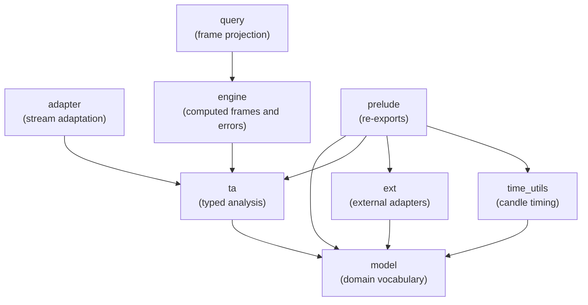

# algotrap — Library Orientation

## Purpose

`algotrap` is a Rust library for typed OHLCV technical-analysis computation and optional
post-compute SQL projection. Its layers separate market data, analysis, stream adaptation,
result frames, query adapters, external integrations, and candle-timing utilities so each
concern can evolve without widening the others.

---

## Dependency Direction



Rules:

- `model` is a leaf and defines the shared domain vocabulary.
- `ta` and `ext` consume domain models without depending on query or engine concerns.
- `adapter` owns stream adaptation only; it does not become a second computation layer.
- `engine` owns computed result contracts, while `query` consumes those contracts for projection.
- `prelude` gathers selected public surfaces but introduces no new behavior.
- Cycles are forbidden by design.

---

## Module Boundaries

| Module | Boundary |
|---|---|
| `model` | Shared market and timeframe vocabulary; no computation or I/O |
| `ta` | Stateful typed analysis and indicator operators; no engine, query, or runtime boundary |
| `adapter` | Stream adaptation around analysis inputs; no TA computation or frame ownership |
| `engine` | Computed result frames and the library-wide market error contract; no SQL or external I/O |
| `query` | Query interfaces and projection adapters over computed frames; no persistent storage |
| `ext` | External market-data and notification integrations; no internal computation layer |
| `time_utils` | Candle-timing and close-boundary helpers; no model construction |
| `prelude` | Convenience re-exports only |

---

## Conceptual Data Flow

```text
external data ──► domain rows ──► typed analysis ──► computed frame
                                               │
                                               └─ optional query projection
                                                        │
                                                        ▼
                                                 owned result consumption
```

Applications acquire or receive market data, pass domain rows through the typed analysis
layer, and assemble a computed frame. A query adapter may project that frame without moving
the computation into the query layer. Consumers then read the resulting frame through the
stable computed-frame contract.

---

## Stable Public Contract Categories

The durable public surface is organized around these categories:

- **Domain models** — shared market, timeframe, and direction values.
- **Typed analysis** — stateful processing and indicator/operator composition.
- **Stream adaptation** — boundaries for feeding analysis from streaming sources.
- **Computed frames** — owned and view-oriented result representations.
- **Query projection** — interfaces for querying already-computed frames, including the
  optional DuckDB integration.
- **External integrations** — market-data and notification adapters kept outside the core.
- **Time utilities** — candle-period and close-boundary calculations.
- **Error contracts** — analysis failures are normalized at the engine boundary for
  downstream consumers.
- **Prelude exports** — convenience access to the intended library surface.

---

## Error Flow

```text
analysis errors ──► engine error contract ──► query and application consumers
```

The engine layer translates analysis failures into the library-wide error contract so query
and application code can handle one downstream error category. Timing helpers retain their
own boundary where calendar calculations need a distinct result type.

---

## Navigation

- [`./model/README.md`](./model/README.md) — domain model types
- [`./ta/README.md`](./ta/README.md) — typed analysis and operators
- [`./engine/README.md`](./engine/README.md) — computed frames and market errors
- [`./query/README.md`](./query/README.md) — frame query and projection adapters
- [`./ext/README.md`](./ext/README.md) — external adapters
